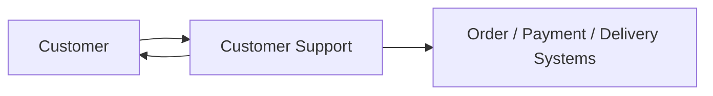
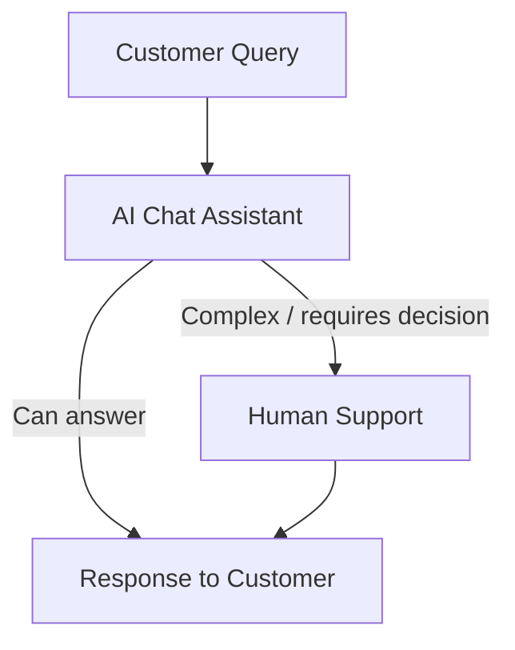
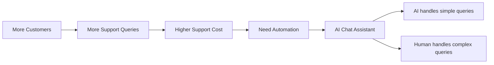

# AI Customer Support Chat Assistant

## 1. Problem

E-commerce customers frequently ask about:

| Query           | Example                      |
| --------------- | ---------------------------- |
| Order status    | Has my order been processed? |
| Payment status  | Did my payment succeed?      |
| Delivery status | Where is my order?           |
| Delivery issue  | Why hasn't my order arrived? |
| Damaged product | My T-shirt arrived damaged   |

### Traditional approach

**Problem:** Customer support becomes expensive as the customer base grows.

Costs include:

* Hiring
* Training
* Employee replacement
* Scaling the support team

For **low-margin businesses**, support costs can significantly reduce or eliminate profits.

---

## 2. Initial Ways to Reduce Cost

| Approach                | Idea                                                              | Limitation                     |
| ----------------------- | ----------------------------------------------------------------- | ------------------------------ |
| Educate customers       | Clearly communicate delivery times, policies, and support process | Doesn't eliminate support      |
| Lower-cost support team | Move support operations to cheaper labor markets                  | Still requires a large team    |
| Automate support        | Let software handle common queries                                | Requires an intelligent system |

Eventually, **automation becomes necessary at scale**.

---

## 3. Using LLMs for Customer Support

Large Language Models (LLMs) can handle many common customer queries.

Instead of every query going directly to a human:

### Key idea

> **AI handles what it can; humans handle what requires judgment or complex resolution.**

---

## 4. Proposed System

### AI Chat Assistant

The assistant should:

1. Accept customer support queries.
2. Understand the customer's problem.
3. Answer queries it can resolve.
4. Escalate complex cases to a human.

### Human-in-the-loop

The goal is **not necessarily to replace customer support**, but to reduce the number of queries humans need to handle.

| Query Type                  | Handler              |
| --------------------------- | -------------------- |
| Simple / repetitive         | AI                   |
| Requires system information | AI + backend systems |
| Complex complaint           | Human                |
| Final resolution / judgment | Human                |

---

## 5. Core Design Insight

**Business problem → Cost reduction → Automation → AI-assisted support**

### Takeaway

The AI customer support system is essentially a **hybrid support model**:

**LLM + Business/Backend Systems + Human Support**

This is the starting point for designing an AI-powered customer support architecture.
