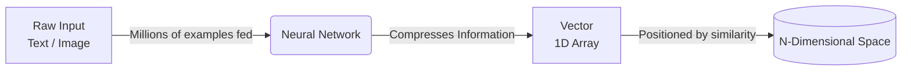
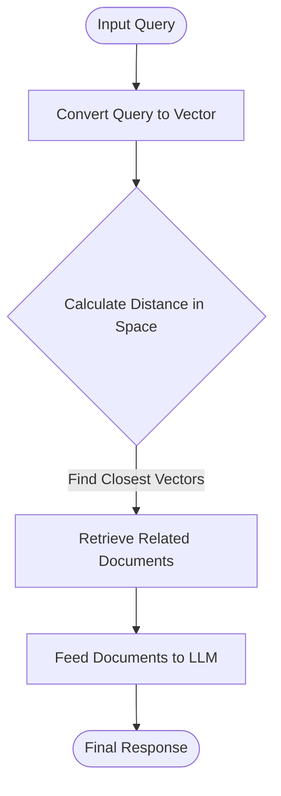

## Vectorization and N-Dimensional Space

Vectors compress complex, high-dimensional information (like large text documents or raw images) into a mathematical representation that retains the object's deep meaning while discarding noise.

### The Vectorization Pipeline

### The 2D Mental Model

To understand multi-dimensional vectors, imagine plotting documents on just two dimensions: **X-axis** (Length) and **Y-axis** (Reality/Non-Fiction).

| Document Example | X-Axis (Length) | Y-Axis (Reality) | Resulting Spatial Cluster |
| --- | --- | --- | --- |
| **Harry Potter** | High (Lengthy) | Low (Fictional) | Bottom-Right |
| **Sherlock Holmes** | High (Lengthy) | Medium (Believable) | Mid-Right |
| **"Attention Is All You Need"** | Low (Short paper) | High (Reality-based) | Top-Left |

Because 2D (or even 3D/4D) is insufficient to capture the full meaning of all global documents, large language models (LLMs) restrict their vector space to a fixed, massive number of dimensions. For example, **LLaMA uses 4,096 dimensions**.

---

### Training and Euclidean Distance

Neural networks are trained to plot vectors accurately using **distance metrics** (such as Euclidean distance).

* **Reward/Penalty System:** If the model plots a vector for a "21-year-old" close to an "89-year-old," it is penalized (loss increases) via backpropagation because they are dissimilar. If it plots them far apart, it is rewarded.
* **Goal:** To cluster conceptually similar objects tightly together in the n-dimensional space.

### Implementation Strategies

| Approach | Best For | Pros & Cons | Example Use Case |
| --- | --- | --- | --- |
| **Off-the-Shelf Libraries** | General use cases | **Pros:** Pre-trained, fast, well-tested. 

 **Cons:** May capture irrelevant noise. | Standard text search. |
| **Fine-Tuning (Custom)** | Specialized domains | **Pros:** Ignores irrelevant data. 

 **Cons:** Time-consuming, requires manual inputs and parallel GPU processing (TensorFlow/PyTorch). | E-commerce image search (focusing *only* on a T-shirt, ignoring the human model's face/posture). |

---

### The Final Retrieval Flow (RAG)

The ultimate purpose of generating these vectors is to power search and LLM context retrieval:

---
[Prev](../01.Intro/01.UseCase.md) | [Index](../../INDEX.md) | [Next](002.ChoosingTheRightDB.md)