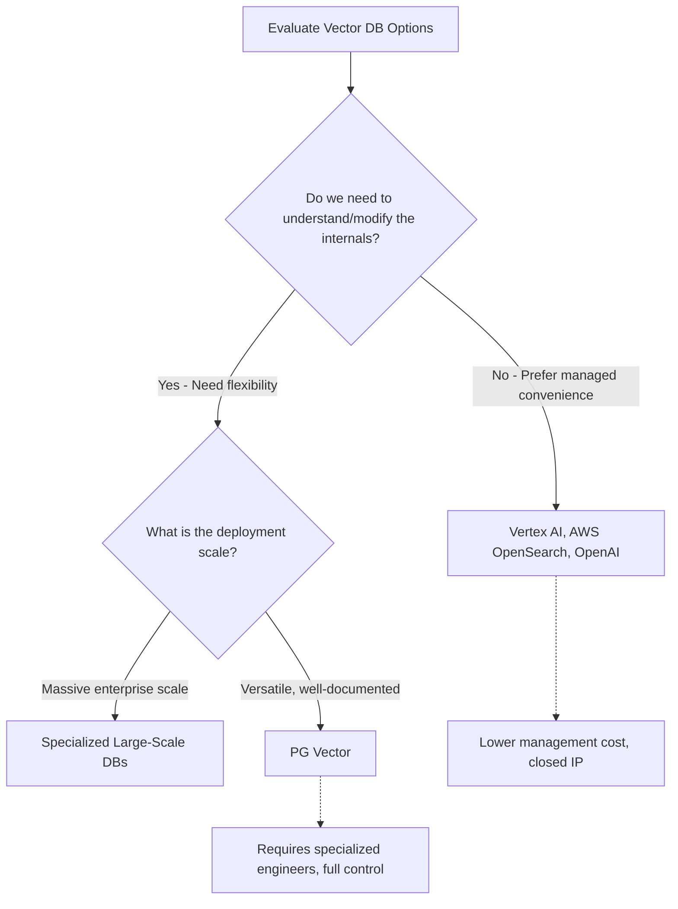

## Why Traditional Databases Fall Short for AI

Relational and NoSQL databases are built for exact matches and 1D sorting, making them incompatible with the high-dimensional data used in AI.

* **The Indexing Problem:** Traditional databases use binary search on 1D sorted indexes (like alphabetical names). Binary search is mathematically impossible across hundreds or thousands of dimensions.
* **Unnecessary Overhead:** Relational databases enforce ACID properties (perfect consistency, fast exact updates) which are essential for financial transactions but unnecessary for AI similarity searches.

## Vector Databases vs. Relational Databases

Vector databases trade perfect accuracy for immense speed when querying massive, complex datasets. They achieve this by clustering vectors and representing entire clusters with a single point.

| Feature | Relational Databases | Vector Databases |
| --- | --- | --- |
| **Data Format** | Rows, columns, 1D sorted data | N-dimensional 1D arrays (Vectors) |
| **Search Mechanism** | Exact match, Binary Search | Similarity search (Nearby clusters) |
| **Accuracy** | 100% exact retrieval | Inexact (trades slight accuracy for speed) |
| **Consistency** | Strict ACID properties | Eventual consistency acceptable |
| **Best For** | Financial systems, user records | Search, recommendations, text generation |

---

## Evaluating Vector Database Options

When implementing a vector database, organizations must weigh managed convenience against open-source flexibility.

### The Verdict: PG Vector

For domain-specific requirements where you might need to change how the system works tomorrow, **PG Vector** is often the optimal choice.

* **Transparent:** Built on Postgres with robust, open documentation.
* **Adaptable:** Unlike closed-source managed solutions (Google Vertex AI, OpenAI), you have full visibility into the system architecture.
* **Cost Trade-off:** While setup costs are similar across the board, open-source solutions like PG Vector require hiring specialized engineers for maintenance, balancing higher payroll costs against greater architectural freedom.

---
[Prev](001.HowAreVectorsConstructed.md) | [Index](../../INDEX.md) | [Next](003.VectorCompression.md)