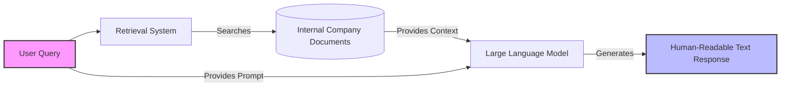
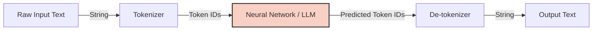
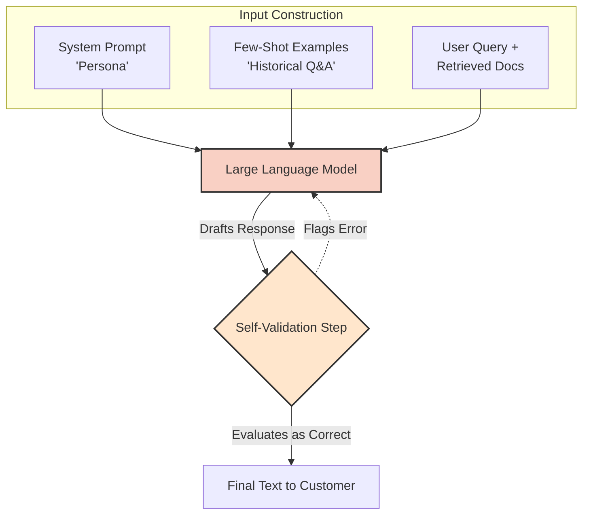

## System Architecture: Customer Support Workflow

## Component Breakdown

| Component | Function in System | Examples |
| --- | --- | --- |
| **Input Queries** | The initial trigger from the user requiring support. | Order status, delivery tracking. |
| **Document Retrieval** | Matches the query against the company's internal knowledge base to find relevant data. | Shipping policies, user account data. |
| **LLM Generation** | Synthesizes the original query and the retrieved documents to formulate a natural response. | "Your package is currently at the local hub..." |

## Upcoming Learning Objectives

The next section of the course/presentation will cover:

* **Core Concepts:** What Large Language Models (LLMs) are.
* **Internal Mechanics:** How LLMs process information and generate text under the hood.
* **Engineering Best Practices:** Key considerations for software engineers to effectively implement and optimize LLMs.

## LLM Internal Architecture

## 1. Data Processing & Tokenization

Before text reaches the neural network, it must be gathered and compressed.

| Concept | Explanation | Purpose / Benefit |
| --- | --- | --- |
| **Data Sourcing** | Scraping high-quality sources (arXiv, GitHub, Wikipedia, raw HTML) and parsing them into readable text. | Provides the foundational knowledge base for the model. |
| **Tokenization** | Splitting text into sub-word pieces (e.g., "catching" $\rightarrow$ "catch" + "ing") and assigning each a unique ID. | Forms the model's standard vocabulary. (Algorithms include Byte-Pair Encoding, Byte Latent). |
| **Compression** | Grouping characters into tokens reduces the total sequence length compared to raw text. | Transformers rely on Attention, which has an $O(N^2)$ complexity. Fewer tokens drastically speed up processing. |
| **Separation of Concerns** | Keeping the tokenizer entirely separate from the neural network's vector space mapping. | Allows engineers to upgrade compression algorithms independently from the core LLM prediction engine. |

## 2. The Training Mechanism

Inside the "black box," the neural network learns through continuous prediction and adjustment.

* **Next-Token Prediction:** The model processes a sequence of token IDs (e.g., "I went to the...") and calculates the probability of what the next token should be ("mall").
* **Weight Adjustment:** During training, the model is rewarded for correct predictions and penalized for incorrect ones. This continuous feedback loop adjusts the network's internal weights.
* **Scale:** By repeating this process across trillions of tokens, the model becomes highly accurate at mapping input text to mathematically sensible output predictions.

## 3. Financial & Strategic Realities (Build vs. Buy)

Building a foundational model from scratch is mathematically and financially prohibitive for most organizations.

| Factor | Description |
| --- | --- |
| **Energy Costs** | Electricity alone for training runs into the millions (e.g., DeepSeek claimed ~$5M, LLaMA ~$2M). |
| **Hardware Costs** | Acquiring the necessary scale of GPUs/TPUs requires massive, difficult-to-secure capital investment. |
| **Engineering Complexity** | Building a foundational LLM is comparable in difficulty to building a custom database or operating system. |
| **The Verdict** | **Do not build from scratch.** Startups and medium-sized companies should leverage pre-trained open models (like LLaMA, DeepSeek R1) and build around them. |

## 4. Current System Status & Next Steps

At this stage, the core AI chat support system (Retrieval-Augmented Generation) is functionally complete:
**User Query + Retrieved Documents $\rightarrow$ LLM Context $\rightarrow$ Generated Text Response**

While this covers 90% of the core functionality, the final 10% requires engineering guardrails.

## Enhancing RAG Systems: Quality & Guardrails

## The Three Engineering Pillars

When deploying an LLM into production, engineers must optimize for three core objectives to prevent a poor customer experience.

| Objective | Focus | Example Scenario |
| --- | --- | --- |
| **Accuracy** | Eliminating hallucinations and ensuring factual correctness based *only* on retrieved data. | Preventing the model from promising a 45-day delivery when the actual policy is 60 days. |
| **Cost Control** | Managing the inherently high costs of running or calling large models. | Keeping prompt sizes efficient to minimize API token charges. |
| **User Experience (UX)** | Maintaining contextual awareness across a multi-turn conversation. | If a user asks "Are there discounts for it?", the model knows "it" refers to the t-shirt discussed previously. |

## Techniques to Reduce Hallucinations

To elevate the quality of the baseline Retrieval-Augmented Generation (RAG) setup, you can implement these three prompt engineering strategies:

* **System Prompting (Persona Restriction):**
* *What it is:* Explicitly telling the model *who* it is (e.g., "You are a customer support executive for X company. Answer only using the provided documents.")
* *Why it works:* Base models are trained on general internet data to be anything. Restricting their persona narrows their focus and significantly improves response relevance.

* **Few-Shot Prompting (Leading by Example):**
* *What it is:* Appending a few real examples of past user queries and ideal human responses directly into the prompt before asking the new question.
* *Why it works:* It demonstrates the exact expected behavior, formatting, and tone, rather than just describing it.

* **Self-Validation (The Evaluation Step):**
* *What it is:* Having the model generate a response internally, and then running a secondary prompt asking the model, "Is this correct based on the provided documents?"
* *Why it works:* Neural networks are intrinsically better at *evaluating* existing data (e.g., classifying an image) than *generating* new data from scratch.

The provided transcript focuses on engineering strategies for optimizing Large Language Model (LLM) architectures in production systems, specifically balancing cost reduction with improved user experience and data security.

Here are the key takeaways from the lecture:

### 1. Reducing LLM Operational Costs

The speaker highlights that running LLMs at scale is expensive (e.g., ~$0.02 per query for OpenAI APIs, or high compute costs for self-hosted models). Traditional caching (like CDNs) doesn't work for LLMs, so engineers must use alternative optimization strategies:

* **Semantic Vector Caching:** Because users can phrase the same question differently (e.g., "How long will delivery take?" vs. "Expected delivery time please"), standard text caching fails. Instead, convert input queries into vector embeddings. If a new query's vector is extremely close to a cached query's vector, the system can return the cached response without calling the LLM, significantly reducing costs for repetitive queries.
* **Model Right-Sizing:** Don't use massive, deep-reasoning models (like OpenAI's o1 or DeepSeek) for basic, automated support queries. Smaller, faster, in-memory models are cheaper and sufficient for routine tasks, while complex issues can be routed to human operators.
* **Token & Context Optimization (RAG Efficiency):** Costs are directly proportional to the number of input tokens. Instead of sending massive system prompts or entire documents as context, use a Vector Database to retrieve only the single most relevant paragraph or section (based on vector similarity to the query) and feed only that small chunk to the LLM.
* **Rate Limiting:** A necessary stopgap to prevent system collapse or budget overruns, though it doesn't fundamentally optimize the architecture.

### 2. Improving User Experience (UX) with Agents

Accuracy isn't just about factual correctness; it's about fulfilling the user's *true intent*. For example, if a user asks "What is the size of this t-shirt?", they actually want to know if it will fit them.

* **Agentic Workflows:** To move beyond simple Q&A, use AI agents (via frameworks like Amazon Bedrock or OpenAI Swarm) to manage stateful, multi-step customer journeys. Agents can route a user from generating a lead, to converting a sale, to offering personalized recommendations based on their current state in the flow.

### 3. Data Privacy and Security

When logging or caching user queries and LLM responses, systems must protect against data leakage.

* **PII Scrubbing:** Use Regular Expressions (RegEx) or other filtering methods to detect and anonymize Personally Identifiable Information (PII)—like credit card numbers and email addresses—before storing inputs or outputs in system logs or databases.

---
[Prev](../02.Vectors/003.VectorCompression.md) | [Index](../../INDEX.md)