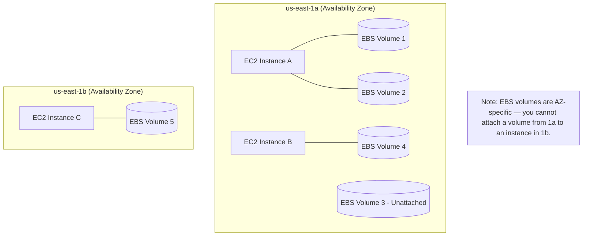

Here are clean, structured **markdown notes** with a **Mermaid diagram** to help you copy directly into your notes or a Markdown editor:

---

# 🧠 EC2 Storage Options — EBS (Elastic Block Store)

## 📦 What is EBS?

* **EBS (Elastic Block Store)** is a **network drive** that can be attached to EC2 instances.
* It allows **data persistence** — data remains even after the EC2 instance is terminated.
* You can **recreate an instance** and **re-attach** the same EBS volume to recover your data.

---

## ⚙️ Key Characteristics

* **Network-attached storage** (not physically attached).
* Can be **attached to only one EC2 instance at a time** (at AWS CCP level).
* **Bound to an Availability Zone (AZ)** —

  * Example: A volume in `us-east-1a` cannot attach to an instance in `us-east-1b`.
* Can be **detached** and **re-attached quickly**, useful for **failovers**.
* **Provisioned capacity required upfront** — specify:

  * 📏 Size (GB)
  * ⚡ IOPS (I/O Operations per Second)
* **Billed** for the provisioned capacity, not usage.
* Capacity can be **increased later** for more size or performance.

---

## 🧩 Analogy

Think of EBS volumes as **network-based USB sticks**:

* You can plug (attach) and unplug (detach) them between machines.
* But they connect **over the network**, not physically.

---

## 🗺️ Architecture Diagram

---

## 🧱 Delete on Termination

* Each EBS volume has an attribute:
  **"Delete on Termination"**
  (visible during EC2 instance creation in the console).

| Volume Type                  | Default Behavior | Description                           |
| ---------------------------- | ---------------- | ------------------------------------- |
| **Root Volume**              | ✅ Enabled        | Deleted when instance is terminated   |
| **Additional EBS Volume(s)** | ❌ Disabled       | Preserved even if instance terminates |

### Example Use Case:

If you want to **preserve the root volume data** after instance termination (e.g., logs, debugging),
→ **Disable** “Delete on Termination”.

---

## 🧾 Summary

| Feature               | Description                        |
| --------------------- | ---------------------------------- |
| Type                  | Network block storage              |
| Persistence           | Survives instance termination      |
| AZ Scope              | Locked to one AZ                   |
| Attach Limit          | One instance at a time (CCP level) |
| Use Case              | Store OS, data, databases          |
| Cost Model            | Billed for provisioned GB + IOPS   |
| Delete on Termination | Configurable per volume            |

---

**Prev**: [EC2 Instance Pricing](18.EC2InstancePricing.md) | **Next**: [EBS Snapshot](20.EBSSnapshot.md) | [Index](../INDEX.md)