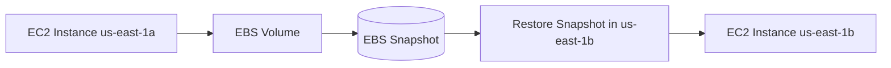
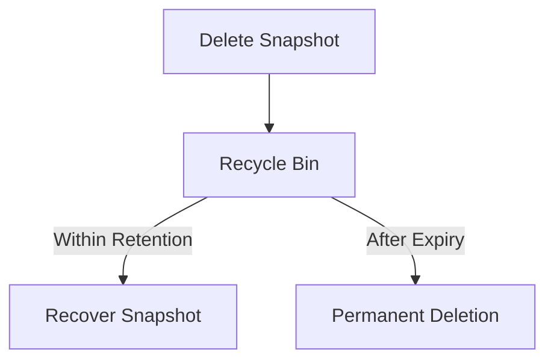

### 🧠 EBS Snapshots (AWS EC2)

**Definition:**

* EBS Snapshot = a **point-in-time backup** of an EBS volume.
* You **don’t need to detach** the volume from the EC2 instance to create a snapshot (though it’s recommended for consistency).
* Snapshots can be **copied across Availability Zones (AZs)** or even **across AWS Regions**.

---

### 📦 Example Scenario

* EC2 instance in **us-east-1a** has an **EBS volume**.
* EC2 instance in **us-east-1b** wants a copy.
* Steps:

  1. Take a **snapshot** of the EBS volume in us-east-1a.
  2. **Restore** that snapshot into us-east-1b.

This effectively **transfers an EBS volume between AZs**.

---

### ⚙️ EBS Snapshot Features

#### 1. **EBS Snapshot Archive**

* Moves snapshots to an **archive tier** (cheaper storage).
* **Cost:** Up to **75% cheaper** than standard snapshots.
* **Restore time:** **24–72 hours** (not immediate).
* Ideal for **long-term retention** where fast access is not needed.

---

#### 2. **Recycle Bin for EBS Snapshots**

* Prevents **accidental permanent deletion**.
* When deleted, snapshots go to a **Recycle Bin** instead of being erased.
* **Retention period:** can be set from **1 day to 1 year**.
* Allows **easy recovery** within that retention window.

---

#### 3. **Fast Snapshot Restore (FSR)**

* Performs **full initialization** upfront.
* Eliminates **first-use latency** when creating a volume from a snapshot.
* Useful for **large snapshots** or when you need **instant readiness**.
* **Cost:** High — use only when required.

---

### 🧾 Summary of Features

| Feature               | Purpose                                | Cost    | Restore Time               | Notes                           |
| --------------------- | -------------------------------------- | ------- | -------------------------- | ------------------------------- |
| Snapshot Archive      | Long-term, low-cost storage            | Low     | 24–72 hours                | Not immediate                   |
| Recycle Bin           | Recover deleted snapshots              | Regular | Instant (within retention) | Protects from accidental delete |
| Fast Snapshot Restore | Pre-initialize snapshot for no latency | High    | Instant                    | Ideal for large snapshots       |

---

**Prev**: [EBS Overview](19.EBSOverview.md) | **Next**: [AMI Overview](21.AMIOverview.md) | [Index](../INDEX.md)
