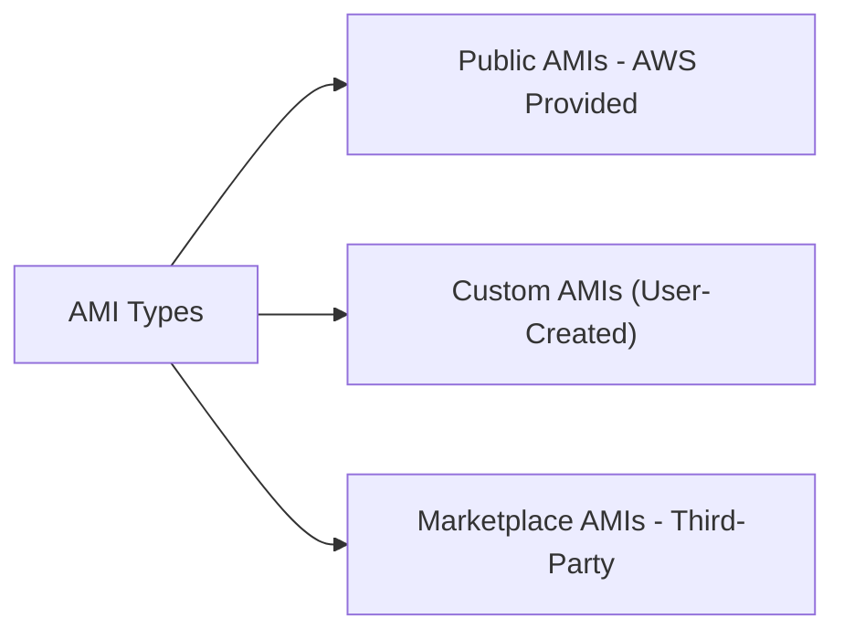
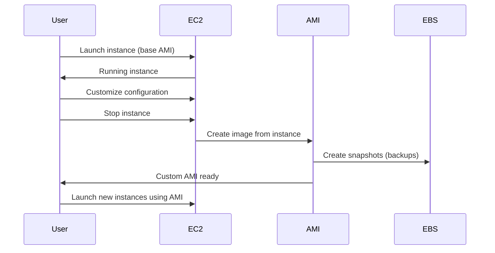
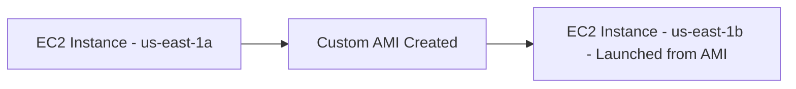

### ⚙️ Amazon Machine Image (AMI)

**Definition:**

* **AMI** = *Amazon Machine Image*
* It represents a **customization of an EC2 instance**.
* AMIs define **how an EC2 instance is launched**, including:

  * Operating system
  * Software configuration
  * Monitoring tools
  * Any pre-installed applications

---

### 🧩 Purpose of an AMI

* Provides a **blueprint** for launching EC2 instances.
* Using a custom AMI:

  * Reduces **boot time** and **configuration time**
  * Ensures **consistent environment setup**
* AMIs are **region-specific** but can be **copied across regions** for global use.

---

### 🖥️ Types of AMIs

1. **Public AMIs**

   * Provided by **AWS**
   * Example: *Amazon Linux 2 AMI*
   * Free to use, pre-configured for general workloads

2. **Custom AMIs**

   * Created by **users**
   * Allow complete control over software setup
   * Must be **maintained manually** (though automation tools exist)

3. **AWS Marketplace AMIs**

   * Created and sold by **third-party vendors**
   * Often come pre-configured with licensed software
   * You can also **publish and sell** your own AMIs on the marketplace

---

### 🧱 Components Inside an AMI

Each AMI includes:

* **Base OS** (Linux, Windows, etc.)
* **Application Server / Software Stack**
* **Custom Configurations**
* **Monitoring / Security Agents**

---

### 🪄 AMI Creation Process

1. **Start an EC2 Instance**

   * Choose a base AMI (e.g., Amazon Linux 2).

2. **Customize the Instance**

   * Install software, configure settings, etc.

3. **Stop the Instance**

   * Ensures **data integrity** before imaging.

4. **Create AMI from Instance**

   * Behind the scenes, AWS takes **EBS snapshots** of attached volumes.

5. **Launch New Instances from AMI**

   * Use your custom AMI to create identical EC2 instances.

---

### 🌍 Multi-AZ / Multi-Region Example

Scenario:

* You have an EC2 instance in **us-east-1a**.
* You want to replicate it in **us-east-1b**.

Process:

1. Launch and customize EC2 instance in **us-east-1a**.
2. Create a **custom AMI** from it.
3. Use that AMI to **launch a new instance** in **us-east-1b**.

---

### ✅ Summary

| Concept               | Description                                   |
| --------------------- | --------------------------------------------- |
| **AMI**               | Blueprint for launching EC2 instances         |
| **Public AMI**        | Provided by AWS, general-purpose              |
| **Custom AMI**        | User-created, pre-configured, faster launches |
| **Marketplace AMI**   | Third-party prebuilt images (can be sold)     |
| **Behind the scenes** | AMI creation triggers EBS snapshots           |
| **Multi-Region**      | AMIs can be copied across regions for reuse   |

---

**Prev**: [EBS Snapshot](20.EBSSnapshot.md) | **Next**: [EC2 Instance Store](22.EC2InstanceStore.md) | [Index](../INDEX.md)
