### ⚙️ EC2 Instance Store

**Definition:**

* **EC2 Instance Store** = *Temporary (ephemeral) storage* physically attached to the **host server** running the EC2 instance.
* It provides **very high disk I/O performance** because it’s **directly connected** to the underlying hardware.

---

### 🧩 Concept Overview

* EC2 instances are **virtual machines** hosted on physical servers.
* Some of these servers have **local disks** (NVMe or SSDs) directly attached to them.
* The storage provided by those disks is what we call **Instance Store**.

---

### 🚀 Performance Characteristics

* **Extremely high I/O throughput and low latency.**
* Used for workloads needing **fast disk access** (e.g., caching, temp data, scratch space).
* Example instance types with Instance Store: **I3, I4, D2**, etc.

**Performance Comparison Example:**

| Type                    | Example       | Read IOPS    | Write IOPS   |
| ----------------------- | ------------- | ------------ | ------------ |
| **Instance Store (I3)** | NVMe SSD      | ~3.3 million | ~1.4 million |
| **EBS gp2 Volume**      | Network-based | ~32,000      | ~32,000      |

➡️ **Instance Store** is **~100× faster** than general-purpose EBS in IOPS.

---

### ⚠️ Limitations

1. **Ephemeral Nature**

   * Data is **lost when**:

     * The instance is **stopped**, **terminated**, or **fails**.
   * Storage is **not persistent** across reboots or stops.

2. **Host Failure Risk**

   * If the **underlying physical server fails**, all Instance Store data is lost.

3. **Not Backed by AWS**

   * AWS **does not replicate or back up** Instance Store data.
   * **User responsibility** to back up and replicate if needed.

```mermaid
flowchart TD
    A[EC2 Instance Running] --> B[Instance Store Active]
    B -->|Stop/Terminate Instance| C[Data Lost ❌]
    A -->|Host Failure| C
```

---

### 📦 Use Cases

| Use Case            | Description                                         |
| ------------------- | --------------------------------------------------- |
| **Cache / Buffer**  | Temporary, high-speed data processing               |
| **Scratch Data**    | Intermediate data for computation or rendering      |
| **Temporary Files** | Logs or transient data                              |
| **Not for**         | Databases, persistent storage, or long-term backups |

---

### 🧠 Key Points

* Instance Store = **High performance, non-persistent** local disk.
* Data loss on **stop, terminate, or hardware failure**.
* **EBS** is the alternative for **durable** storage.
* Use for **temporary or cache** data only.
* From an **exam or architecture** perspective →
  “High performance + ephemeral = EC2 Instance Store.”

---
**Prev**: [AMI Overview](21.AMIOverview.md) | **Next**: [EBS Volume Types](23.EBSVolumeTypes.md) | [Index](../INDEX.md)