### ⚙️ EBS Volume Types Overview

EBS (Elastic Block Store) offers **six types of volumes**, grouped into **SSD** (Solid State Drives) and **HDD** (Hard Disk Drives) categories.

---

### 🧩 SSD Volumes — High Performance

#### 1. **gp2 / gp3 — General Purpose SSD**

* **Goal:** Balance between cost and performance.
* **Use cases:** Boot volumes, virtual desktops, dev/test environments, general workloads.

| Attribute      | **gp2**                                  | **gp3**                                        |
| -------------- | ---------------------------------------- | ---------------------------------------------- |
| Volume Size    | 1 GB – 16 TB                             | 1 GB – 16 TB                                   |
| Baseline IOPS  | Size-dependent (3 IOPS/GB, up to 16,000) | 3,000 IOPS baseline                            |
| Max IOPS       | 16,000                                   | 16,000                                         |
| Max Throughput | ~250 MB/s                                | Up to 1,000 MB/s                               |
| Relationship   | IOPS linked to size                      | IOPS and throughput configurable independently |
| Use Case       | Older gen, predictable scaling           | New gen, cost-effective and flexible           |

**Key takeaway:**

* **gp3** decouples performance from size (you can set IOPS and throughput independently).
* **gp2** performance grows with size (3 IOPS per GB).

```mermaid
graph LR
    A[gp2 Volume Size ↑] --> B[IOPS ↑ linked]
    C[gp3 Volume Size] --> D[IOPS set independently]
    C --> E[Throughput set independently]
```

---

#### 2. **io1 / io2 Block Express — Provisioned IOPS SSD**

* **Goal:** For **mission-critical**, **low-latency**, **high-throughput** workloads (e.g., databases).
* **Performance** and **IOPS** are **user-provisioned** (not automatically scaled).

| Attribute            | **io1**                              | **io2 Block Express**                       |
| -------------------- | ------------------------------------ | ------------------------------------------- |
| Volume Size          | 4 GB – 16 TB                         | Up to 64 TB                                 |
| Max IOPS             | 64,000 (Nitro EC2) / 32,000 (others) | 256,000                                     |
| Latency              | <1 ms                                | Sub-ms                                      |
| IOPS/GB Ratio        | Up to 50:1                           | Up to 1,000:1                               |
| Multi-Attach Support | ✅ Yes                                | ✅ Yes                                       |
| Durability           | 99.9%                                | 99.999%                                     |
| Use Case             | High I/O database                    | Enterprise-grade, ultra-low latency systems |

**Key takeaway:**

* For **databases** or **IO-intensive apps**, choose **io1/io2**.
* If you need **>32,000 IOPS**, you must use **EC2 Nitro** + **io1/io2**.

---

### 💾 HDD Volumes — High Throughput / Low Cost

#### 3. **st1 — Throughput Optimized HDD**

* **Goal:** Low-cost storage for **frequently accessed**, large, sequential data.
* **Use cases:** Big data, data warehousing, log processing, streaming workloads.
* **Performance:**

  * Max Throughput: **500 MB/s**
  * Max IOPS: **500**
  * Volume Size: **Up to 16 TB**

#### 4. **sc1 — Cold HDD**

* **Goal:** Lowest-cost HDD for **infrequently accessed** data.
* **Use cases:** Archive, cold data, backups.
* **Performance:**

  * Max Throughput: **250 MB/s**
  * Max IOPS: **250**
  * Volume Size: **Up to 16 TB**

---

### 🔑 Boot Volume Compatibility

| Volume Type   | Boot Volume Supported? |
| ------------- | ---------------------- |
| **gp2 / gp3** | ✅ Yes                  |
| **io1 / io2** | ✅ Yes                  |
| **st1 / sc1** | ❌ No                   |

---

### 🧠 Exam Summary

| Category                 | Volume Type | Performance               | Use Case                    | Notes                                   |
| ------------------------ | ----------- | ------------------------- | --------------------------- | --------------------------------------- |
| **General Purpose SSD**  | gp2/gp3     | Balanced                  | OS boot, general workloads  | gp3 = newer, decoupled IOPS/size        |
| **Provisioned IOPS SSD** | io1/io2     | Highest I/O               | Databases, low latency apps | io2 Block Express = extreme performance |
| **HDD (Throughput)**     | st1         | High throughput, low IOPS | Big data, analytics         | Not bootable                            |
| **HDD (Cold)**           | sc1         | Lowest cost               | Archive, infrequent access  | Not bootable                            |

---

### ⚡ Quick Recall Rules

* **gp3** → Newer, independent IOPS/throughput.
* **gp2** → Older, IOPS tied to size.
* **io1/io2** → Database-grade, provisioned performance.
* **st1/sc1** → HDDs; cheap, throughput-focused, not bootable.
* **>32,000 IOPS → Requires Nitro EC2 + io1/io2.**

---

**Prev**: [EC2 Instance Store](22.EC2InstanceStore.md) | **Next**: [EBS Multi Attach](24.EBSMultiAttach.md) | [Index](../INDEX.md)