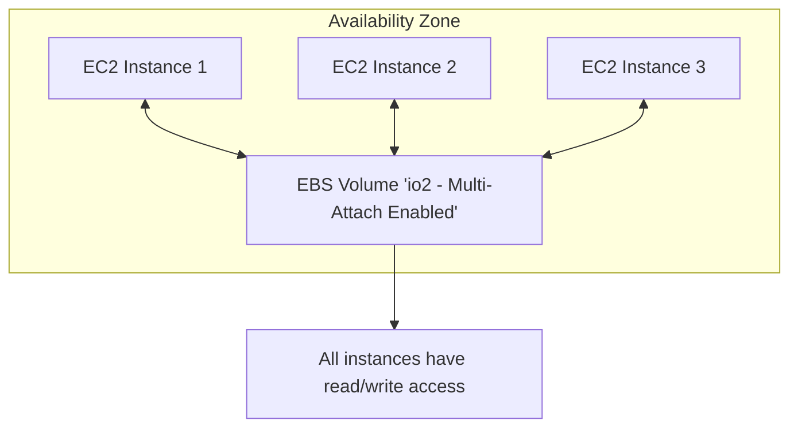

## 🧩 EBS Multi-Attach Feature

### 🔍 Overview

* **Multi-Attach** allows **a single EBS volume** to be **attached to multiple EC2 instances** simultaneously.
* Works **within the same Availability Zone (AZ)** only.
* Supported **only for `io1` and `io2` EBS volume types**.

---

### ⚙️ Key Properties

| Property                 | Details                                                        |
| ------------------------ | -------------------------------------------------------------- |
| Supported Volume Types   | `io1`, `io2`                                                   |
| Max Instances per Volume | **16 EC2 instances**                                           |
| Access Type              | **Full read and write** for each instance                      |
| Availability             | **Single AZ only**                                             |
| File System Requirement  | Must use a **cluster-aware file system** (not `XFS` or `EXT4`) |

---

### 🧠 Use Cases

* **High availability** applications with **shared storage** (e.g., clustered Linux applications).
* **Concurrent write operations** where multiple instances need simultaneous disk access.
* Example: **Teradata clusters** or **database clusters** with shared data volume.

---

### ⚡ Diagram: Multi-Attach Concept

---

### ⚠️ Limitations

* **Cannot attach across AZs** — limited to **a single AZ**.
* **Requires cluster-aware file system** to avoid data corruption.
* **Limited to 16 instances per volume**.

---

### 📝 Summary

| Feature          | Description                                                  |
| ---------------- | ------------------------------------------------------------ |
| **Purpose**      | Shared, high-performance block storage between multiple EC2s |
| **Volume Types** | `io1`, `io2`                                                 |
| **AZ Scope**     | Single AZ                                                    |
| **Max EC2s**     | 16                                                           |
| **Use Cases**    | Clustered DBs, shared storage systems                        |
| **Filesystem**   | Cluster-aware only                                           |

---
**Prev**: [EBS Volume Types](23.EBSVolumeTypes.md) | **Next**: [EFS Overview](25.EFSOverview.md) | [Index](../INDEX.md)