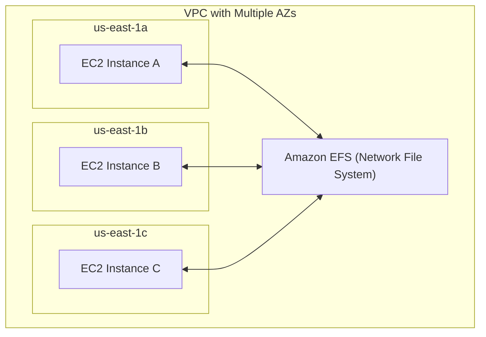
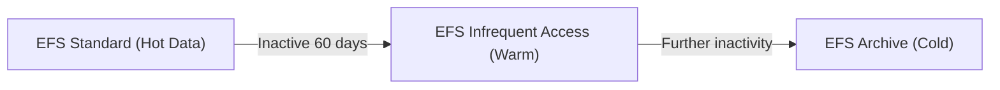

## 📁 Amazon EFS — Elastic File System

### 🔍 Overview

* **EFS (Elastic File System)** is a **managed NFS (Network File System)** by AWS.
* Can be **mounted on multiple EC2 instances** **across multiple Availability Zones** (AZs).
* **Fully managed, scalable, and highly available.**
* **Pay-per-use** — no capacity provisioning required.
* **3× more expensive** than a GP2 EBS volume.

---

### ⚙️ Core Characteristics

| Feature          | Description                                     |
| ---------------- | ----------------------------------------------- |
| Type             | Managed **NFS** (Network File System)           |
| Mountable On     | Multiple EC2 instances across **different AZs** |
| Pricing          | Pay per GB used (no pre-provisioning)           |
| OS Compatibility | **Linux-based AMIs only** (Not for Windows)     |
| Protocol         | NFS (v4.x)                                      |
| Access Control   | Security Groups                                 |
| Encryption       | Supported at rest using **AWS KMS**             |
| File System Type | **POSIX-compliant**, standard Linux API         |

---

### 🧠 Use Cases

* **Content Management Systems** (WordPress, CMS)
* **Web serving** (shared site data across instances)
* **Data sharing** between instances
* **Home directories** or shared code/data repositories

---

### 🌐 Architecture Diagram

✅ All EC2 instances (in different AZs) mount the **same shared file system**.

---

### ⚡ Scalability & Performance

* **Automatically scales** to petabytes.
* **Thousands of concurrent NFS clients** supported.
* **10+ GB/s throughput possible.**

---

### 🧩 Performance Modes (set at creation)

| Mode                          | Description                               | Use Case                   |
| ----------------------------- | ----------------------------------------- | -------------------------- |
| **General Purpose** (default) | Low latency                               | Web servers, CMS           |
| **Max I/O**                   | Higher latency but **massive throughput** | Big data, media processing |

---

### 🚀 Throughput Modes

| Mode            | Description                                                           | Characteristics                                                     |
| --------------- | --------------------------------------------------------------------- | ------------------------------------------------------------------- |
| **Bursting**    | Scales with storage size (e.g., 50 MB/s + burst to 100 MB/s per 1 TB) | Default option                                                      |
| **Provisioned** | Fixed throughput, independent of storage                              | Predictable workloads                                               |
| **Elastic**     | Automatically adjusts up/down with workload                           | Ideal for unpredictable workloads (up to 3 GB/s read, 1 GB/s write) |

---

### 💾 Storage Classes (Tiers)

| Tier                           | Purpose                        | Description                  |
| ------------------------------ | ------------------------------ | ---------------------------- |
| **EFS Standard**               | Frequently accessed data       | High availability (multi-AZ) |
| **EFS-IA (Infrequent Access)** | Less frequently accessed files | Lower cost, retrieval fee    |
| **EFS Archive**                | Rarely accessed data           | Lowest storage cost          |

#### Lifecycle Management

* Automatically **moves files between tiers** after a set number of days.
* Example: File in EFS Standard → moved to EFS-IA after 60 days of inactivity.

---

### 🧱 Availability & Durability

| Option                      | Zones                         | Use Case             | Notes                      |
| --------------------------- | ----------------------------- | -------------------- | -------------------------- |
| **EFS Standard (Multi-AZ)** | Multiple                      | Production           | High availability          |
| **EFS One Zone**            | Single AZ                     | Dev/Test             | Lower cost                 |
| **EFS One Zone-IA**         | Single AZ + Infrequent Access | Archive-like storage | Up to **90% cost savings** |

---

### 📝 Summary

| Feature                  | Details                        |
| ------------------------ | ------------------------------ |
| **Type**                 | Managed NFS (Linux only)       |
| **Scalability**          | Automatic to petabytes         |
| **Performance Modes**    | General Purpose, Max I/O       |
| **Throughput Modes**     | Bursting, Provisioned, Elastic |
| **Storage Classes**      | Standard, EFS-IA, Archive      |
| **Availability Options** | Multi-AZ or One-Zone           |
| **Encryption**           | AWS KMS supported              |
| **Lifecycle Management** | Automatic tier transitions     |
| **Cost Saving**          | Up to 90% via storage tiers    |

---

**Prev**: [EBS Multi Attach](24.EBSMultiAttach.md) | **Next**: [EBS vs EFS vs Instance Store](26.EBSvsEFSvsInstanceStore.md) | [Index](../INDEX.md)
