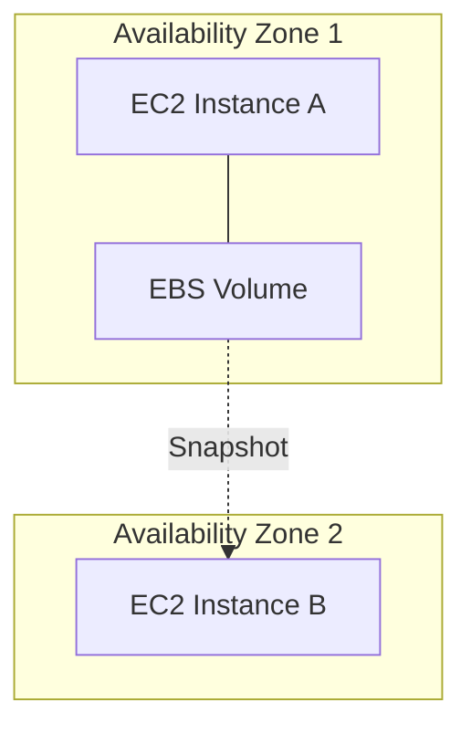
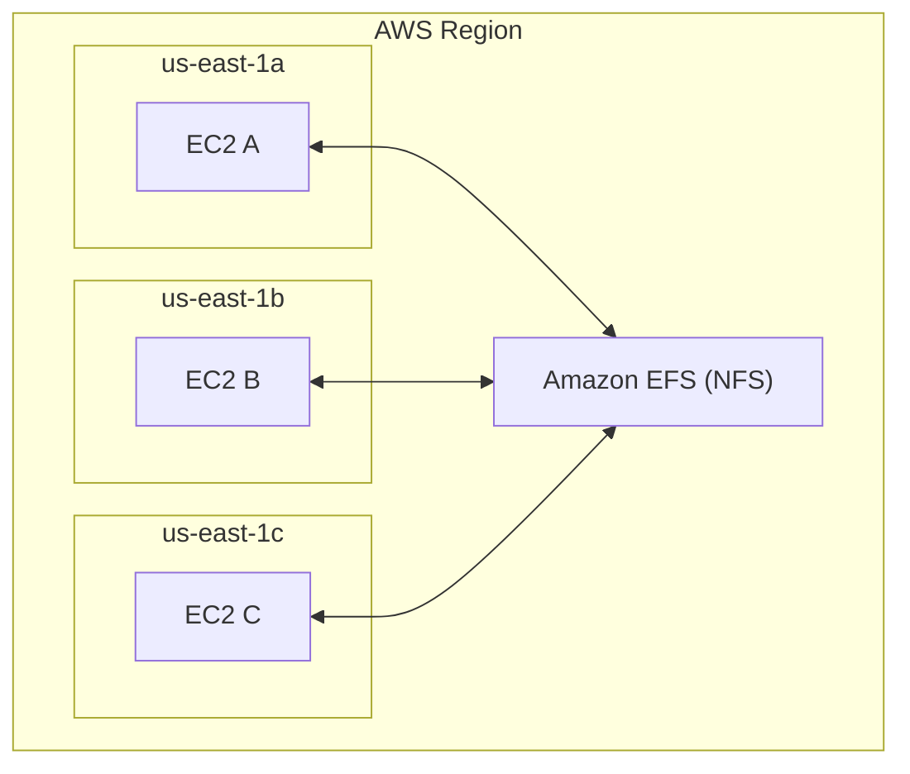
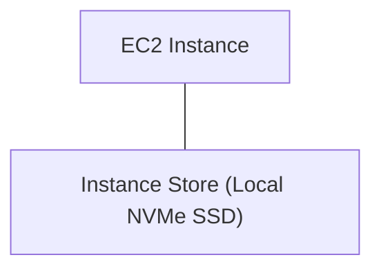

## 💾 EBS vs EFS vs Instance Store — AWS Storage Comparison

---

### ⚙️ 1. Amazon EBS (Elastic Block Store)

**Definition:**
Block-level storage **attached to one EC2 instance at a time** (like a hard drive for your EC2).

**Key Features:**

* Can attach to **one instance per AZ**.
* Can use **Multi-Attach** (only for `io1` / `io2`) for up to **16 EC2 instances** (special cases).
* **Tied to an Availability Zone** (cannot move directly across AZs).
* To move across AZs → take a **snapshot** → restore in another AZ.
* **Backups use I/O**, so should not be done during high traffic.
* **Root volume** is deleted by default when EC2 terminates (can disable this).

**Performance & Behavior:**

* `gp2`: IOPS increases with size.
* `gp3`, `io1`, `io2`: IOPS can be configured **independent of size**.

---

### 🌐 2. Amazon EFS (Elastic File System)

**Definition:**
Managed **Network File System (NFS)** that can be **mounted by multiple EC2 instances** across AZs.

**Key Features:**

* Accessible by **hundreds of EC2 instances** **across multiple AZs**.
* Ideal for **shared data**, like WordPress content or web app assets.
* Only works with **Linux-based AMIs** (POSIX-compliant).
* **Higher cost** than EBS but supports **lifecycle tiers** (Standard, IA, Archive).
* Fully **elastic** — scales automatically based on usage.

---

### 💽 3. Instance Store (Ephemeral Storage)

**Definition:**
Physical **hardware disk attached to the EC2 host machine** (local, high-speed storage).

**Key Features:**

* **Extremely high performance** (I/O operations).
* **Ephemeral** — data lost if the EC2 instance stops or terminates.
* Best for **temporary data**, caches, or buffers.
* Must handle **your own backup and replication**.

---

### 🧭 Comparison Summary

| Feature              | **EBS**                                   | **EFS**                                | **Instance Store**                     |
| -------------------- | ----------------------------------------- | -------------------------------------- | -------------------------------------- |
| **Type**             | Block storage                             | Network file system (NFS)              | Local hardware disk                    |
| **Attach To**        | One EC2 per AZ (Multi-Attach for io1/io2) | Many EC2s across AZs                   | One EC2 (physically attached)          |
| **AZ Scope**         | Single AZ                                 | Multi-AZ                               | Single EC2 host                        |
| **Data Persistence** | Persistent                                | Persistent                             | **Ephemeral (lost on stop/terminate)** |
| **Scalability**      | Manual resize                             | Auto-scaling (elastic)                 | Fixed by instance                      |
| **Performance**      | High                                      | Scales with demand (network-dependent) | **Very high (local hardware)**         |
| **Cost**             | Moderate                                  | Higher                                 | No separate cost (included in EC2)     |
| **Use Case**         | Databases, OS root, transactional apps    | Shared file system, CMS, web apps      | Cache, scratch, temp data              |
| **OS Support**       | Linux & Windows                           | Linux only                             | OS-agnostic                            |
| **Backup**           | Snapshots                                 | Lifecycle tiers                        | Manual                                 |
| **Cross-AZ Use**     | Via snapshot                              | Native (multi-AZ)                      | Not supported                          |

---

### 📊 Architecture Visualization

#### EBS (Single Instance per AZ)

💡 *EBS is AZ-bound. To move it, create a snapshot and restore in another AZ.*

---

#### EFS (Shared File System across AZs)

💡 *EFS enables shared access across multiple AZs and EC2 instances.*

---

#### Instance Store (Local, Ephemeral)

💡 *Instance Store is tied to the physical host — data lost if the instance stops.*

---

### 🧠 Key Takeaways

* **EBS** → Best for **persistent block storage** per EC2 (databases, boot volumes).
* **EFS** → Best for **shared network file storage** across multiple EC2s (CMS, NFS workloads).
* **Instance Store** → Best for **temporary high-performance data** (cache, buffers).

---

**Prev**: [EFS Overview](25.EFSOverview.md) | [Index](../INDEX.md)
