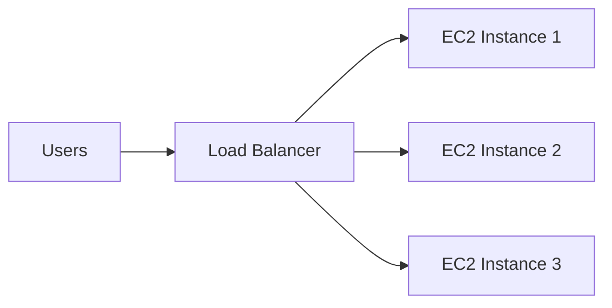
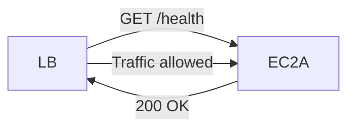
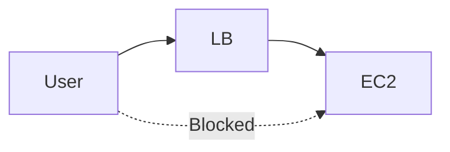

# 📘 Load Balancing — Notes

## 🔹 What is Load Balancing?

A **load balancer** is a server (or managed service) that distributes incoming user traffic across multiple backend servers (e.g., EC2 instances).

### 🎯 Goal

* Prevent one server from being overloaded
* Improve performance & reliability
* Provide a single entry point for users

Users connect to **one endpoint**, and the load balancer decides where requests go.

---

## 🔹 Basic Architecture

### ✔ Key Idea

* Users never connect directly to backend servers
* Load is distributed automatically

---

## 🔹 Why Use a Load Balancer?

### 1️⃣ Single Point of Access

* One DNS name / IP for your app

### 2️⃣ Failure Handling

* If one instance fails → traffic goes to healthy ones

### 3️⃣ Health Checks

* Automatically monitor backend servers

### 4️⃣ SSL Termination

* Handles HTTPS encryption centrally

### 5️⃣ Session Stickiness

* Can route a user to the same backend using cookies

### 6️⃣ High Availability

* Spreads traffic across multiple Availability Zones

### 7️⃣ Traffic Separation

* Can handle internal vs public traffic differently

---

## 🔹 AWS Elastic Load Balancer (ELB)

The AWS-managed load balancer is provided by **Amazon Web Services**.

### ✔ Advantages

* Fully managed (no server maintenance)
* Auto-scaling built in
* High availability guaranteed
* Cheaper & easier than self-hosting

### ✔ Integrates With

* **Amazon EC2**
* **Amazon ECS**
* **AWS Certificate Manager**
* **Amazon CloudWatch**
* **Amazon Route 53**
* **AWS WAF**
* **AWS Global Accelerator**

---

## 🔹 Health Checks

Load balancer periodically checks if instances are working.

### Example Configuration

* Protocol: HTTP
* Port: 4567
* Path: `/health`
* Success response: HTTP **200 OK**

If no 200 response → instance marked **Unhealthy** → no traffic sent.

---

## 🔹 Types of AWS Load Balancers

### 🧓 1. Classic Load Balancer (CLB) — Legacy

* Supports HTTP, HTTPS, TCP, SSL
* Deprecated for new apps

---

### 🌐 2. Application Load Balancer (ALB)

* Layer 7 (HTTP/HTTPS)
* Smart routing based on:

  * URL path
  * Hostname
  * Headers
* Supports WebSockets

✔ Best for web applications & microservices

---

### ⚡ 3. Network Load Balancer (NLB)

* Layer 4 (TCP/UDP)
* Extremely fast
* Handles millions of requests/sec

✔ Best for:

* Real-time apps
* Gaming
* Financial systems

---

### 🔐 4. Gateway Load Balancer (GWLB)

* Layer 3 (IP level)
* Used for security appliances:

  * Firewalls
  * Deep packet inspection

✔ Best for network security setups

---

## 🔹 Public vs Internal Load Balancers

### Public Load Balancer

* Internet-facing
* Used for websites

### Internal Load Balancer

* Private network only
* Used for internal services

---

## 🔹 Security Setup

### 🧑‍💻 User → Load Balancer

Security group:

* Port 80 / 443
* Source: `0.0.0.0/0` (anywhere)

---

### 🖥 Load Balancer → EC2

EC2 security group:

* Allow port 80
* Source = **Load Balancer security group**

✔ Ensures backend servers are never exposed directly.

---

# 📌 Key Takeaways

* Load balancer distributes traffic across servers
* Provides high availability, security, and performance
* AWS ELB is managed → no infrastructure headaches
* Always prefer **ALB/NLB/GWLB** over Classic LB

---
