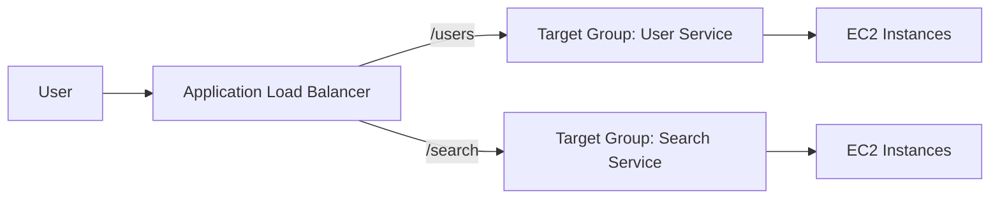
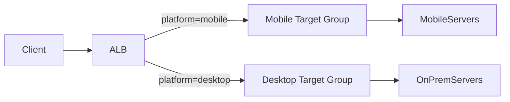
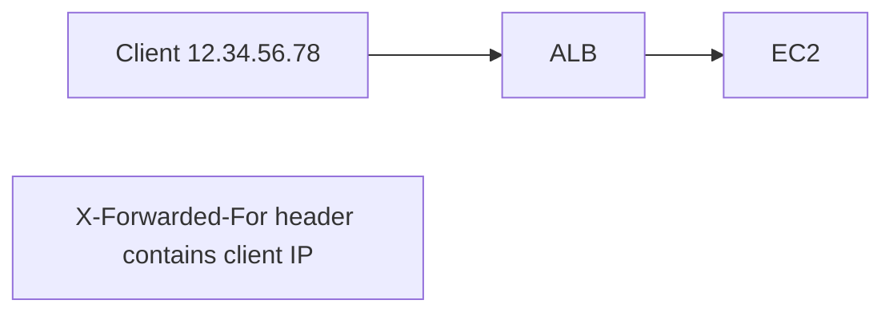

# 📘 Application Load Balancer (ALB) — Notes

## 🔹 What is an Application Load Balancer?

An **Application Load Balancer** is a **Layer 7 (HTTP/HTTPS)** load balancer in **Amazon Web Services**.

👉 Operates at the **application layer**, meaning it understands:

* URLs
* Paths
* Hostnames
* Headers
* Query strings

This allows **intelligent routing** instead of simple traffic distribution.

---

## 🔹 Core Capabilities

### ✔ Layer 7 Routing

Routes traffic based on HTTP request details.

### ✔ Multiple Apps Behind One LB

One ALB can serve many applications.

### ✔ HTTP Features

* Supports **HTTP/2**
* Supports **WebSockets**
* Supports automatic **HTTP → HTTPS redirect**

### ✔ Microservices Friendly

Designed for:

* Containers
* APIs
* Microservice architectures

Often used with:

* **Amazon ECS**
* **Amazon EC2**
* **AWS Lambda**

---

## 🔹 Target Groups (Key Concept)

ALB routes traffic to **target groups**.

A target group is a collection of backend services.

### Target groups can contain:

* EC2 instances
* ECS containers
* Lambda functions
* Private IP addresses (on-prem servers)

Health checks run **per target group**.

---

## 🔹 ALB Routing Example (Microservices)



👉 One ALB
👉 Multiple services
👉 Smart routing rules

This is why ALB is ideal for **microservices architecture**.

---

## 🔹 Types of Routing Supported

### 1️⃣ Path-Based Routing

Route based on URL path.

Examples:

* `/users` → User service
* `/orders` → Order service

---

### 2️⃣ Host-Based Routing

Route based on hostname.

Examples:

* `api.example.com` → API service
* `admin.example.com` → Admin panel

---

### 3️⃣ Query String / Header Routing

Route based on request parameters.

Example rule:

```
?platform=mobile → Mobile backend
?platform=desktop → Desktop backend
```

---

## 🔹 Example: Intelligent Routing



👉 ALB can even route to **on-premise servers** via private IPs.

---

## 🔹 ALB vs Classic Load Balancer

| Feature                     | Classic LB | ALB             |
| --------------------------- | ---------- | --------------- |
| Routing intelligence        | ❌ Basic    | ✅ Smart routing |
| Multiple apps behind one LB | ❌ No       | ✅ Yes           |
| Microservices ready         | ❌ No       | ✅ Yes           |
| Container support           | ❌ Poor     | ✅ Native        |

👉 With Classic LB you needed **one LB per app**
👉 With ALB → **one LB for many apps**

---

## 🔹 Client IP Behavior (Important!)

ALB **terminates the connection**.

Meaning:

* Backend server does NOT see real client IP
* It sees the ALB IP instead

To preserve client info, ALB adds headers:

| Header            | Purpose        |
| ----------------- | -------------- |
| X-Forwarded-For   | Real client IP |
| X-Forwarded-Port  | Client port    |
| X-Forwarded-Proto | HTTP or HTTPS  |

---

### Connection Flow



👉 Your application must read these headers if it needs the true client IP.

---

## 🔹 Fixed Hostname

Like other AWS load balancers, ALB provides:

* A DNS hostname
* One public entry point

Example:

```
my-alb-123456.region.elb.amazonaws.com
```

---

# 📌 Key Takeaways

* ALB works at **Layer 7 (HTTP level)**
* Routes traffic intelligently based on request content
* Uses **target groups** to organize backends
* Ideal for **microservices, APIs, containers, and serverless**
* Adds headers to preserve original client info

---
