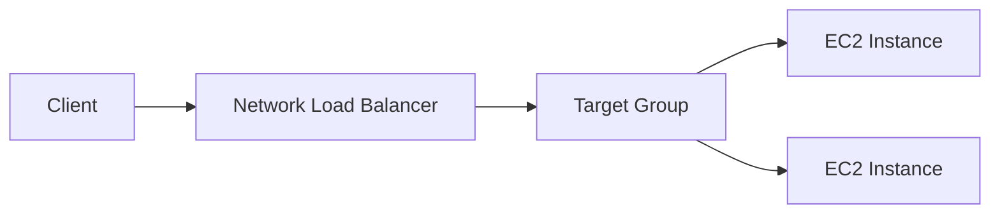
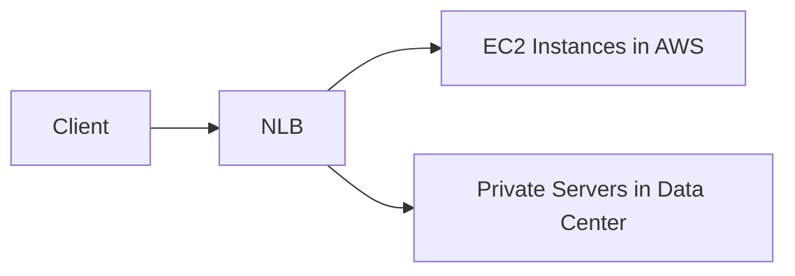

# 📘 Network Load Balancer (NLB) — Notes

## 🔹 What is a Network Load Balancer?

A **Network Load Balancer** is a **Layer 4 load balancer** in **Amazon Web Services**.

👉 Operates at the **transport layer**, meaning it handles:

* TCP
* UDP
* TLS

Unlike ALB, it does **not inspect HTTP content**.

---

## 🔹 When to Use NLB

Use NLB when you need:

✔ Ultra-high performance
✔ Millions of requests per second
✔ Very low latency
✔ Static IP addresses
✔ TCP/UDP traffic

---

## 🔹 Key Characteristics

### ⚡ Extreme Performance

* Designed for high throughput workloads
* Ideal for real-time systems

### 🌐 Static IP Support

* One **static IP per Availability Zone**
* Can assign **Elastic IPs**

👉 Useful when clients must whitelist IPs.

**Exam Tip:**
If question mentions:

* Static IP requirement
* Whitelisting IPs
* UDP traffic
  → Choose **NLB**

---

## 🔹 Architecture

NLB still uses **target groups**, similar to ALB.

---

## 🔹 Target Groups for NLB

NLB can route traffic to:

### ✔ EC2 Instances

Typical use case for scalable infrastructure.

### ✔ Private IP Addresses

Can point to:

* EC2 private IPs
* On-premise servers (via VPN / Direct Connect)

👉 Allows hybrid architecture.

---

## 🔹 Hybrid Example (Cloud + On-Prem)

👉 One load balancer for both environments.

---

## 🔹 NLB in Front of ALB (Advanced Pattern)

You can combine load balancers:

### Why do this?

* NLB → provides static IPs + high performance
* ALB → provides HTTP routing intelligence

👉 Common in enterprise setups.

---

## 🔹 Health Checks

NLB supports health checks using:

* TCP
* HTTP
* HTTPS

👉 Even though it works at Layer 4, it can still use HTTP checks if backend supports it.

---

## 🔹 ALB vs NLB Quick Comparison

| Feature              | ALB            | NLB                        |
| -------------------- | -------------- | -------------------------- |
| Layer                | 7 (HTTP)       | 4 (TCP/UDP)                |
| Routing intelligence | Smart          | Basic                      |
| Static IPs           | ❌ No           | ✅ Yes                      |
| Latency              | Medium         | Ultra low                  |
| Performance          | High           | Extreme                    |
| Use cases            | APIs, web apps | Gaming, finance, streaming |

---

# 📌 Key Exam Memory Hooks

Think **NLB** when you see:

* UDP traffic
* Static IP requirement
* Whitelisting firewall rules
* Extreme performance need
* Low latency systems

Think **ALB** when you see:

* HTTP routing rules
* Microservices
* Path/host routing

---

