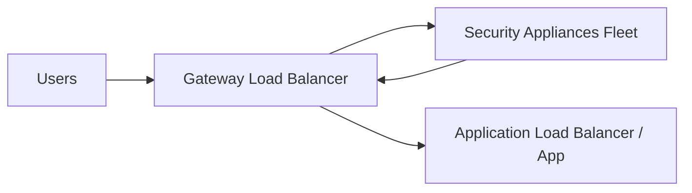
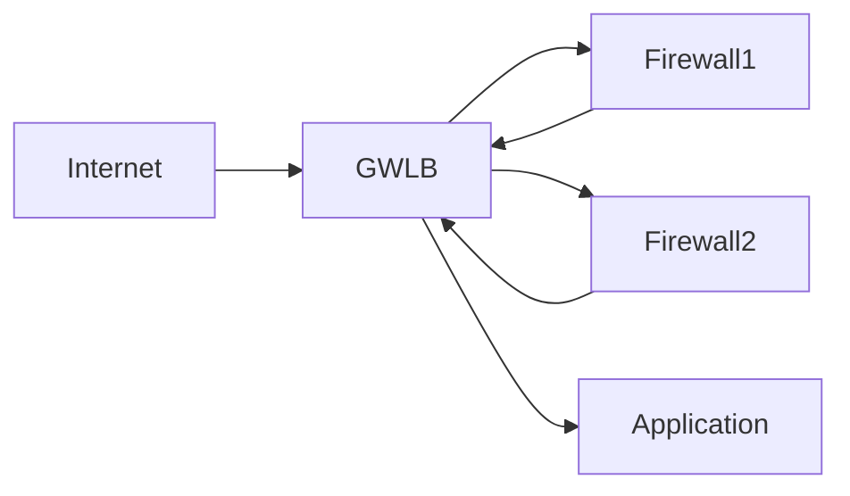

# 📘 Gateway Load Balancer (GWLB) — Notes

## 🔹 What is a Gateway Load Balancer?

A **Gateway Load Balancer** is the newest load balancer in **Amazon Web Services**.

👉 Works at **Layer 3 (Network / IP layer)**
👉 Designed for **security inspection and network appliances**

It allows you to **deploy, scale, and manage third-party security appliances** in your VPC.

---

## 🔹 When Do You Use GWLB?

Use GWLB when you want **ALL network traffic inspected before reaching applications**.

Typical use cases:

* Firewalls
* Intrusion Detection/Prevention Systems (IDS/IPS)
* Deep Packet Inspection (DPI)
* Traffic filtering
* Payload modification at network level

---

## 🔹 Core Idea

Instead of users → app directly,

traffic flow becomes:

👉 All traffic is forced through inspection first.
👉 Appliances can:

* Allow traffic
* Modify traffic
* Drop traffic

For the application, this is **transparent**.

---

## 🔹 Why GWLB Exists

Before GWLB, inserting firewalls into AWS networks was:

* Complex routing
* Hard to scale
* Hard to manage

GWLB simplifies this by acting as:

1️⃣ **A network gateway** (single entry/exit point)
2️⃣ **A load balancer** (distributes traffic across appliances)

---

## 🔹 How It Works Internally

GWLB modifies **VPC route tables** so that:

* Incoming traffic → GWLB
* GWLB → security appliances
* Appliances → GWLB
* GWLB → application

---

## 🔹 GWLB Target Groups

GWLB can send traffic to:

✔ EC2 instances running security software
✔ Private IP addresses (including on-prem appliances)

👉 This supports hybrid security architectures.

---

## 🔹 Protocol Used (Exam Key!)

GWLB uses:

👉 **GENEVE protocol**
👉 Port **6081**

📌 If exam mentions **GENEVE → GWLB immediately**

---

## 🔹 Comparison with Other Load Balancers

| Feature           | ALB          | NLB                   | GWLB                    |
| ----------------- | ------------ | --------------------- | ----------------------- |
| Layer             | 7            | 4                     | 3                       |
| Purpose           | HTTP routing | Performance & TCP/UDP | Security inspection     |
| Understands HTTP  | ✅ Yes        | ❌ No                  | ❌ No                    |
| Static IP support | ❌            | ✅                     | Depends on architecture |
| Main use case     | Web apps     | Real-time systems     | Firewalls & IDS         |

---

## 🔹 Mental Model

### ✔ ALB → Smart web router

### ✔ NLB → Fast traffic forwarder

### ✔ GWLB → Security checkpoint

---

## 📌 Key Exam Memory Hooks

Think **Gateway Load Balancer** when you see:

* Firewalls in AWS
* IDS / IPS systems
* Deep packet inspection
* Need to inspect ALL traffic
* GENEVE protocol mentioned

---
