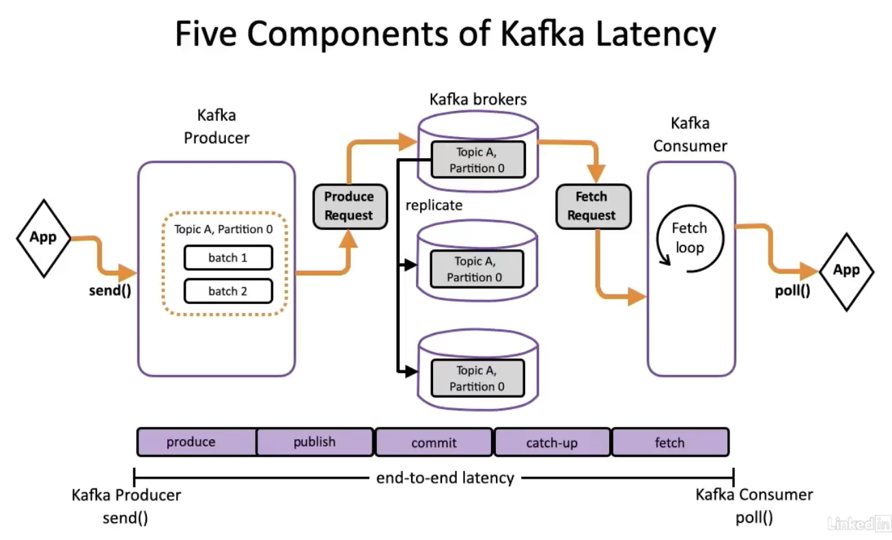

# End-to-End Latency in Kafka

Kafka's end-to-end latency is composed of several key stages:

- **Produce Time**: The time taken from when the application logic produces a record to when the produce request containing the record is sent to the leader partition of the topic. It includes the time required to process and batch the records in the Kafka producer.

- **Publish Time**: The time between when the internal Kafka producer sends a produce request to the broker and when the corresponding message gets appended to the partition leader's replica log.

- **Commit Time**: The time taken to replicate a message from the partition leader to all the follower replicas. It ensures that the message is written out to the leader as well as to the replicas, bringing all follower replicas in sync for fault tolerance.

- **Catch Up Time**: The time taken by the consumer to catch up to the records' offset in the log. If the consumer is lagging behind in reading the messages published to a cluster, the catch-up time will be longer.

- **Fetch Time**: The time taken for a consumer to fetch the record from the broker. It includes the time waiting for enough data to form the response until the consumer actually consumes the message.

These components collectively determine the end-to-end latency in Apache Kafka, affecting how quickly messages can be processed and consumed in the system.

[Prev](03.KafkaOptimizationTheorem.md) 
[Next]()

