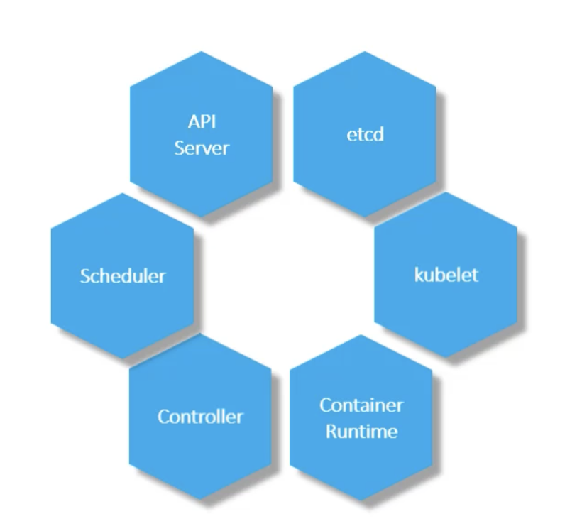
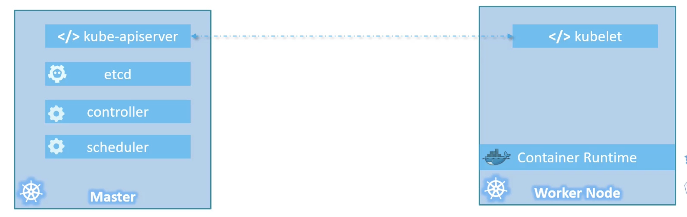

# 🚀 Kubernetes Architecture – Master and Nodes

## 🖥️ What is a Node?
- A Node is a machine (physical or virtual) where Kubernetes is installed
- It is a worker machine where containers are launched
- Previously referred to as minions

## 🔁 What Happens if a Node Fails?
- Application running on that node goes down
- Hence, we use multiple nodes grouped into a Cluster

## 🧱 What is a Cluster?
A Cluster is a group of nodes that ensures:
- High availability (if one node fails, others serve the app)
- Load distribution

## 👑 Role of the Master Node
The Master is:
- A special node with Kubernetes installed, configured as controller
- Manages and orchestrates the entire cluster
- Handles node monitoring, container scheduling, and failure recovery

## ⚙️ Components of Kubernetes

### 📌 Master Node Components

| Component           | Description                                                    |
|--------------------|:---------------------------------------------------------------|
| API Server         | Acts as frontend for the cluster. CLI/tools interact through it|
| etcd               | Key-value store for all cluster data. Ensures consistency      |
| Scheduler          | Assigns newly created containers (pods) to suitable nodes      |
| Controller Manager | Monitors cluster state and performs automated actions          |

### 📌 Worker Node Components

| Component          | Description                                                    |
|--------------------|:---------------------------------------------------------------|
| Kubelet            | Agent running on each worker node. Communicates with Master    |
| Container Runtime  | Software to run containers (Docker, CRI-O, rkt, etc.)         |

## 📤 Master vs Worker – Component Distribution

| Role              | Key Components                                      |
|-------------------|:---------------------------------------------------|
| Master            | kube-apiserver, etcd, controller-manager, scheduler |
| Worker            | kubelet, container runtime, kube-proxy             |

## 🧰 kubectl – Kubernetes Command Line Tool

### Common kubectl Commands

| Command             | Purpose                                  |
|--------------------|:-----------------------------------------|
| kubectl run        | Deploy an application on the cluster      |
| kubectl cluster-info| View information about the cluster       |
| kubectl get nodes  | List all the nodes in the cluster        |

## 📝 Summary
- Kubernetes architecture is based on Master-Worker setup
- Master handles control plane operations; Workers run the actual application workloads
- Communication and orchestration happen via API Server and Kubelet
- All cluster information is stored in etcd, a reliable distributed key-value store
- Use kubectl to interact with the cluster: deploy apps, check status, and manage resources

---
[Prev](002.ContainerOrchestration.md) | [Index](../INDEX.md) | [Next](004.DockervsContainerD.md)

