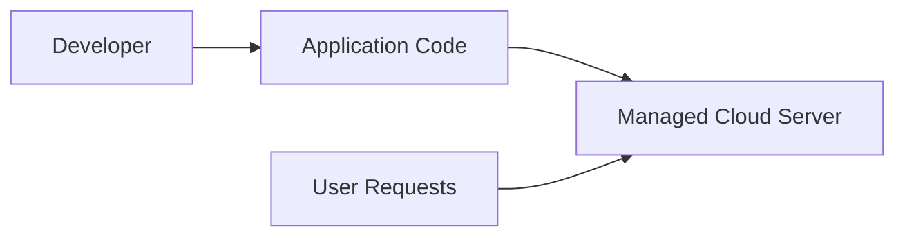
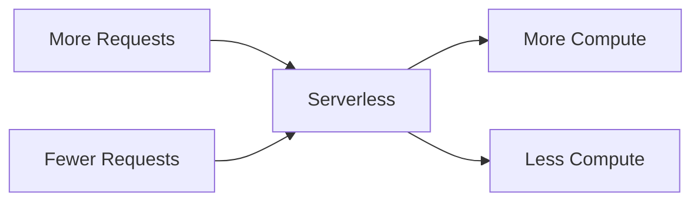
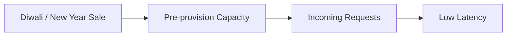

# A Startup is Born

## 1. Where should code run?

Two broad choices:

| Option           | Meaning                                        |
| ---------------- | ---------------------------------------------- |
| **Own computer** | Run the application on hardware you own        |
| **Cloud**        | Rent compute capacity from a provider like AWS |

### Why cloud?

Cloud providers offer better **reliability**:

* Hardware failures can be handled quickly
* New instances can be spun up
* Less concern about power/network failures
* Easier to operate a professional service

---

## 2. Why use Managed Cloud?
Recall the 3 design criteria:

| Criterion      | Managed cloud                                          |
| -------------- | ------------------------------------------------------ |
| **Simplicity** | Provider handles OS, deployment, upgrades, etc.        |
| **Fidelity**   | Both approaches can satisfy requirements               |
| **Cost**       | Lower implementation/operational effort at small scale |

So, **managed cloud is preferred over running your own hardware**. 

---

# 3. Two Cloud Approaches
### A. Managed Server / Instance

You rent a server, but the provider manages the infrastructure.

You still manage:

* Application deployment
* Starting/restarting the server
* Application itself

---

### B. Serverless

You only provide the **code**.

The cloud provider manages:

* Server
* OS
* Capacity
* Scaling
* Execution
* Deployment infrastructure

You essentially say:

> "Run this code whenever a request comes."

You don't need to know:

* What server is running
* Which OS is used
* Whether a server is currently running

---

# 4. Server vs Serverless

The main decision factors are:

### ① Ease of operation

Serverless makes it easier to:

* Setup
* Scale
* Maintain

Scaling is automatic:

You don't need to manually provision capacity.

---

### ② Cost & Performance

Serverless has two main drawbacks.

| Drawback              | Explanation                                                          |
| --------------------- | -------------------------------------------------------------------- |
| **Efficiency / Cost** | Managed servers can sometimes handle more requests for the same cost |
| **Latency**           | Scaling up may take some time, causing slower initial responses      |

### Example

For a predictable sale:

With serverless, capacity is provisioned in response to incoming traffic, so there can sometimes be a delay.

---

# 5. Decision for This Business

The application is:

* Small
* Low volume
* Not expected to have huge traffic spikes

Therefore, the drawbacks of serverless are relatively small.

### Decision

> **Choose serverless for now.**

As the business grows, scaling and performance can be revisited. 

---

## ⭐ Key Takeaways

* **Cloud > own hardware** for reliability and operational simplicity.
* **Managed server:** You manage the application/server lifecycle to some extent.
* **Serverless:** You focus almost entirely on code; cloud provider manages execution.
* Serverless gives **easy automatic scaling**.
* Serverless can have **higher cost per request** and **startup/scaling latency**.
* For a **small, low-volume application → serverless is a good choice**.
* Architecture decisions should be based on **current requirements**, not hypothetical future scale.

---
[Prev](01.WhatIsSystemDesign.md) | [Index](../INDEX.md) | [Next](03.WhereAreThePages.md)
