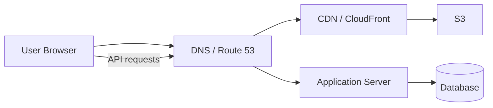
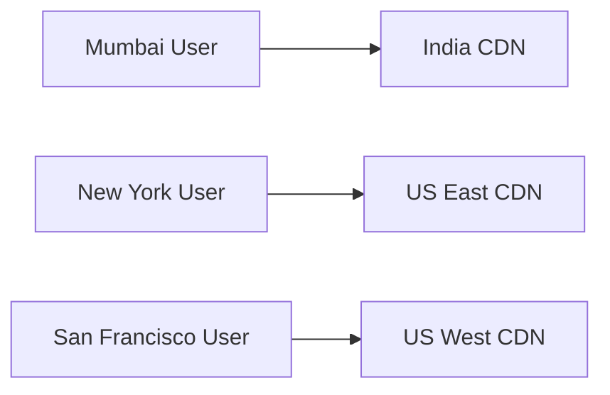
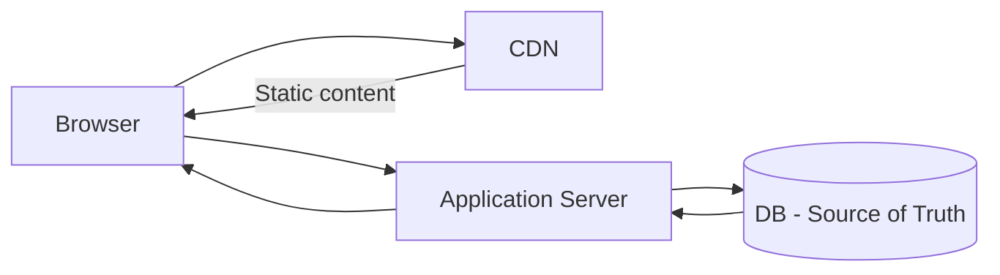
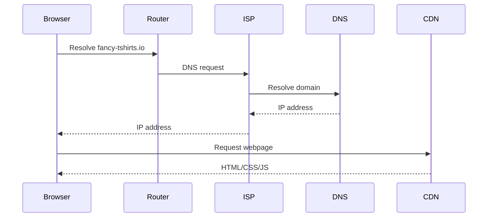
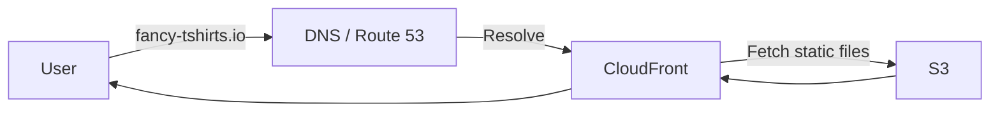
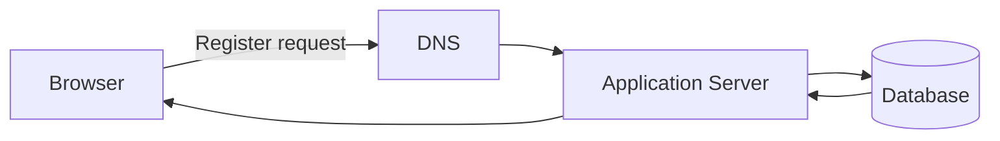
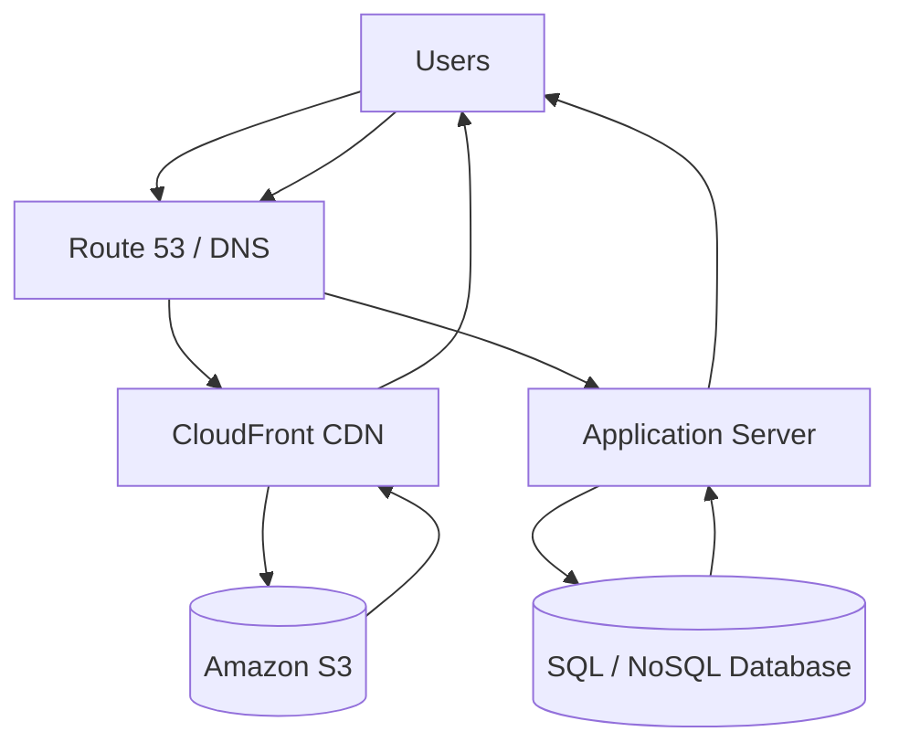

# Where are the pages?

## 1. Basic Architecture

Goal: Users should be able to access `fancy-tshirts.io`, view webpages, and perform actions such as **register/login**. 

The system has two broad parts:

| Type               | Examples                                            | Where to keep     |
| ------------------ | --------------------------------------------------- | ----------------- |
| **Static content** | HTML, CSS, JS, images, videos, product descriptions | CDN               |
| **Dynamic data**   | User data, inventory, registrations, orders         | Server + Database |

### High-level flow



The key idea is to **separate static and dynamic content**. 

---

# 2. Why Use a CDN?

A CDN has servers distributed geographically, allowing users to fetch static content from a nearby location. 

### Benefits

| Serving through your own server    | Using CDN                            |
| ---------------------------------- | ------------------------------------ |
| Must manage global infrastructure  | CDN handles distribution             |
| Higher operational effort          | Managed infrastructure               |
| Potentially higher latency         | Lower latency                        |
| Harder to scale geographically     | Built for global distribution        |
| More expensive to operate yourself | Benefits from CDN economies of scale |

Examples mentioned:

* **Amazon CloudFront**
* **Akamai**
* **Cloudflare**


### Why latency improves



Users connect to a geographically closer CDN server. 

---

# 3. Why Not Put Everything in the CDN?

The main issue is **dynamic data consistency**.

Suppose:

* Total T-shirts = **50**
* US server sees 50
* India server sees 50
* US receives 40 orders
* India receives 11 orders

Both locations may accept their orders independently:

**40 + 11 = 51 orders**

→ Overselling occurs. 

### Key principle

> CDN → great for **static content**
> Server + DB → required for **dynamic / authoritative data**

Dynamic information should come from a central source of truth rather than independently updated CDN copies. 



---

# 4. What Goes into the CDN?

### CDN

* HTML
* CSS
* JavaScript
* Images
* Videos
* Static product information
* Banners

### Server + Database

* Inventory
* Orders
* User accounts
* Registration/login
* Other frequently changing data

 

---

# 5. How Do We Distribute Files Globally?

Instead of manually copying files to every CDN server, use a shared file system.

The idea:


When a new file appears in the file system, the CDN picks it up and distributes it globally. 

### AWS Solution: S3

**Amazon S3** is proposed as the distributed file storage layer.

Advantages mentioned:

* Managed service
* Highly durable
* Consistent
* Cloud-based
* Suitable for storing static assets

The lecture suggests pairing:

> **S3 + CloudFront**


---

# 6. DNS — How Does `fancy-tshirts.io` Find Our Server?

Users don't remember IP addresses. They remember **domain names**.

DNS maintains the mapping:

```text
Domain Name → IP Address
```

Example:

```text
fancy-tshirts.io → <IP address>
```


### Request flow



DNS is itself a **distributed system**. Different DNS providers can communicate to resolve domains. 

---

# 7. Route 53

AWS provides its DNS service called **Amazon Route 53**.

If the application uses AWS:

```text
Domain
   ↓
Route 53
   ↓
CloudFront
   ↓
Static Website
```

The lecture recommends Route 53 together with CloudFront when using AWS. 

---

# 8. Complete Request Flow

### Initial page load



### Dynamic operation

For example, clicking **Register**:



Thus:

**Static request → CDN**

**Dynamic request → Application Server → Database**


---

# 9. Database Choice

The lecture emphasizes that startups often **overthink database selection**. 

### Recommendation

For a startup:

> Use a database the team is comfortable with.

Both **SQL and NoSQL** can work.

If the team has no strong preference:

> **Prefer SQL.**

Reasons given:

| Reason            | Why it matters                       |
| ----------------- | ------------------------------------ |
| Mature technology | Well-established ecosystem           |
| Easier hiring     | More people know SQL                 |
| Analytics         | Easier to work with                  |
| Queries           | Lots of existing knowledge/resources |
| Simplicity        | SQL is relatively easy to learn      |


### Decision mindset

Don't choose based only on:

* Scalability
* Performance
* Technology hype

Also ask:

| Question                   | Example |
| -------------------------- | ------- |
| Does it meet requirements? | ✅       |
| Is it simple?              | ✅       |
| Is it cost-effective?      | Depends |

The lecture emphasizes thinking from the **business perspective**, not only from a technical-performance perspective. 

---

# 10. Final Architecture



### Core takeaways

| Component              | Responsibility                   |
| ---------------------- | -------------------------------- |
| **DNS / Route 53**     | Domain → destination resolution  |
| **CloudFront / CDN**   | Globally serve static content    |
| **S3**                 | Store static files               |
| **Application Server** | Handle dynamic operations        |
| **Database**           | Store dynamic/authoritative data |

**Architecture principle:**
**Push static content to the edge; keep dynamic, consistency-sensitive data behind the application server.**

---
[Prev](02.AStartupIsBorn.md) | [Index](../INDEX.md) | [Next](04.DebuggingInTrenches.md)