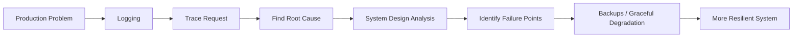
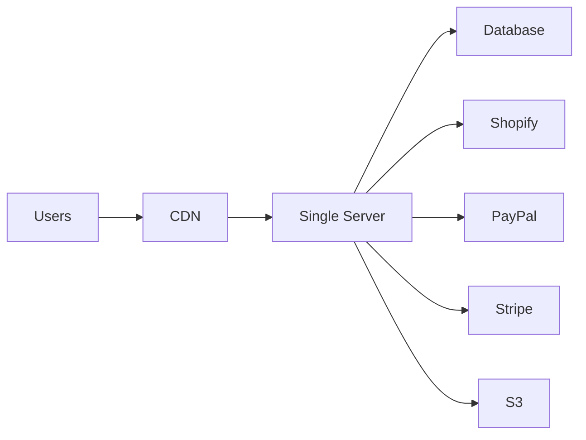
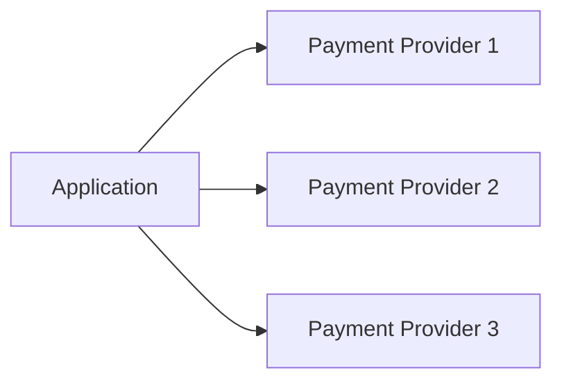

# System Reliability, Observability & Fault Tolerance

## 1. Problem: Production Issues Need Fast Diagnosis

A system may appear healthy initially, but failures such as payment gateway errors can quickly create support problems.

The key issue isn't always the failure rate itself. For example, a payment provider may have a **98% success rate**, meaning 2% failures are expected. The bigger problem can be the inability to **identify and debug failed requests quickly**. 

---

## 2. Logging & Request Tracing

### What to log?

For every request:


| Point               | What to do                                              |
| ------------------- | ------------------------------------------------------- |
| Request received    | Log the request                                         |
| Important operation | Log DB operations / external API calls prone to failure |
| Response            | Log response against the **request ID**                 |


This allows you to trace a request **end-to-end across a distributed system**. 

### Example

```text
Customer Email
      ↓
 Find Order ID
      ↓
 Request ID / Order ID
      ↓
 ┌──────────────────────────────┐
 │ Search logs                  │
 │ → API request                │
 │ → DB operation               │
 │ → Payment gateway call       │
 │ → Response                   │
 └──────────────────────────────┘
```

This makes debugging customer issues much faster. 

### Centralized logging

Instead of building everything yourself, use cloud logging solutions such as **Amazon CloudWatch**. Logs from distributed systems can be centralized and queried. 

---


# 3. Observability

**Observability = ability to understand how well the system is performing.** 

### Dashboard

Track important business/system metrics:


| Metric        | Example              |
| ------------- | -------------------- |
| Daily sales   | 100 → suddenly 10    |
| Visits        | Normal → sudden drop |
| Registrations | Normal → sudden drop |
| Orders        | Normal → sudden drop |


A dashboard allows people to visually identify anomalies quickly. 

For startups, existing tools can be preferable to building everything internally:

- Google Analytics
- Power BI
- Tableau
- Cloud-provider integrations

---


# 4. From Debugging → Prevention

There are two stages:




The goal is to move from **reacting to failures** to **designing systems that tolerate failures**. 

---


# 5. Single Points of Failure (SPOF)

A **Single Point of Failure** is a component whose failure can bring down the business/system.

Example architecture:




Potential SPOFs:


| Component             | Failure impact                             |
| --------------------- | ------------------------------------------ |
| CDN                   | Website cannot be served                   |
| Single server         | Entire application fails                   |
| Database              | Application cannot operate properly        |
| Shopify               | Ordering/business flow may stop            |
| Critical external API | Critical path may fail                     |
| Cloud provider        | Multiple components may become unavailable |


---


# 6. Engineer's Responsibility: Resilience

The objective is not simply **"nothing should ever fail."**

Instead:

> **A component failure should not cause the entire system to collapse.**

The system should either continue working or **degrade gracefully**. 

---


# 7. Techniques for Fault Tolerance


### A. Backups

Example:

```text
Primary DB ──X──> Backup DB
              failure
```

If the primary database fails, a backup can keep the system operational. 

### B. Cloud-managed reliability

Cloud/serverless infrastructure can automatically handle some failures such as restarting infrastructure and routing new requests. 

### C. Multiple external providers

For critical integrations:




Examples mentioned:

- PayPal → Stripe
- Multiple payment providers
- Multiple order/delivery providers

This reduces dependency on a single external vendor. 

---


# 8. Trade-off: More Resilience = More Complexity

Having multiple providers improves availability but increases engineering effort.


| Approach             | Complexity | Resilience |
| -------------------- | ---------- | ---------- |
| Single provider      | Low        | Low        |
| Multiple providers   | High       | High       |
| Graceful degradation | Medium     | High       |


Supporting multiple payment, ordering, and delivery integrations requires additional implementation and maintenance. 

---


# 9. Graceful Degradation

When a critical dependency fails, **don't let the entire application appear broken**.

Example:

```text
Shopify unavailable
        ↓
Detect failure
        ↓
Disable ordering functionality
        ↓
Show clear user message
        ↓
Rest of website remains understandable
```

Instead of an obscure technical error, show a meaningful message to the user. 

### Good error propagation

```text
Backend failure
      ↓
Meaningful error
      ↓
Client
      ↓
Customer support
      ↓
Easy to understand + track
```

Errors should be readable and useful for both users and support teams. 

---


## Key Takeaways


| Concept                  | Core idea                                           |
| ------------------------ | --------------------------------------------------- |
| **Logging**              | Record requests, important operations and responses |
| **Request ID**           | Trace a request across the system                   |
| **Observability**        | Monitor system/business health                      |
| **Dashboard**            | Detect anomalies visually                           |
| **SPOF**                 | One failure can take down the system                |
| **Fault tolerance**      | System continues despite component failures         |
| **Redundancy**           | Use backups/alternative providers                   |
| **Graceful degradation** | Reduce functionality instead of total failure       |
| **Resilience trade-off** | More redundancy → more engineering complexity       |


**Core principle:** Build systems that are **observable, diagnosable, and resilient to failure**, rather than assuming every dependency will always work.

[Prev](03.WhereAreThePages.md) | [Index](../INDEX.md) | [Next](05.HardQuestionHardAnswers.md)