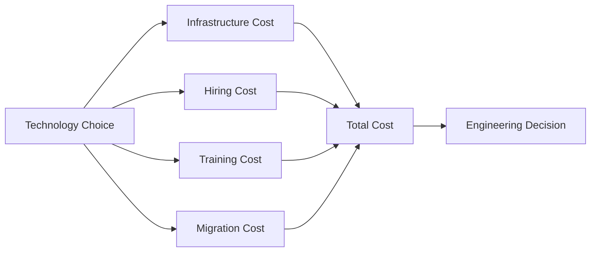
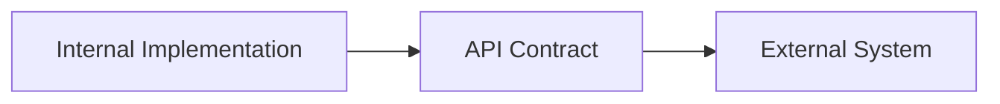

# Engineering Decision-Making & Estimation

## 1. Technical Decisions Must Include Business Context

As a tech lead/engineering manager, don't answer subjective questions with just **pros & cons**. Explain the **benefits, drawbacks, and business impact**. 

Typical questions:

* Should we use **microservices vs monolith**?
* Is **Node.js/Python** fast enough?
* Should we migrate to another technology because hiring is easier?

### Example: Microservices

For a small company/team:

> **Don't introduce microservices just because they are popular.**

The transcript recommends a monolith when the team is small (roughly ≤10–15 people) and not distributed across offices. 

Decision should be based on **actual team and business needs**, not technology hype.

---

# 2. Turn Subjective Questions into Numbers

Instead of:

> "Is Node.js slow?"

Ask:

| Factor         | Question                             |
| -------------- | ------------------------------------ |
| Performance    | How much slower for this workload?   |
| Infrastructure | How many more servers are required?  |
| Hiring         | How much cheaper/easier is hiring?   |
| Training       | How long does onboarding take?       |
| Migration      | What engineering effort is required? |
| Overall        | Is the total cost worth it?          |

The transcript gives an example where a slower technology may require more compute, but **cheaper hiring/training can offset that infrastructure cost**. 



**Principle:** Bring **numbers + business impact** into technical discussions.

---

# 3. Feature Cost = Implementation + Usage

When estimating a feature, don't only ask:

> "How long will developers take to build it?"

Also ask:

> **How frequently will the feature be used?**

Example: virtual T-shirt try-on.

```text
10,000 visitors/day
        ↓
10% use the feature
        ↓
1,000 API calls/day
        ↓
External image-processing API
        ↓
API cost × usage × 30 days
        ↓
Monthly running cost
```


So:

**Total feature cost ≈ Development cost + Ongoing usage cost**

Usage characteristics can dramatically change the economics of a feature. 

---

# 4. Storage Estimation

For files/videos, estimate:

**Total storage = File size × Number of files**

Example from the transcript:

| Assumption  | Value |
| ----------- | ----: |
| Video size  |  1 MB |
| Videos/day  | 1,000 |
| Storage/day | ~1 GB |

Files could be stored in **S3**, with possible later optimizations such as compression or grouping. 

---

# 5. Engineering Priority Order

When implementing a feature:


### Priority

| Priority | Goal                           |
| -------- | ------------------------------ |
| 1️⃣      | Meet all requirements          |
| 2️⃣      | Keep the implementation simple |
| 3️⃣      | Optimize cost                  |

Don't prematurely optimize. First build the **simplest solution that satisfies requirements**, then optimize when cost becomes unacceptable. 

---

# 6. Back-of-the-Envelope Estimation

Common engineering estimation areas:

| Estimate  | Example                 |
| --------- | ----------------------- |
| Storage   | GB/TB required          |
| Memory    | RAM consumption         |
| Bandwidth | Network traffic         |
| Compute   | Number of servers       |
| Cost      | Infrastructure/API cost |


Start with rough calculations and improve accuracy using:

* Product requirements
* PM discussions
* Vendor pricing/documentation


### Key idea

> **Gut feeling is useful, but numbers make engineering decisions stronger and easier to get team alignment on.** 

---

# 7. APIs Are Part of System Design

Once the high-level architecture is designed, don't focus only on **how the internal code is written**.

The more important question is:

> **How is the system exposed to external systems?**




A complex external API contract can:

* Increase development time
* Increase implementation errors
* Make onboarding harder for new developers


Therefore, tech leads should pay close attention to **externally visible interfaces**.

---

# 8. API Contracts & SLAs

The key externally visible pieces discussed are:

| Concept                           | Purpose                                         |
| --------------------------------- | ----------------------------------------------- |
| **API Contract**                  | Defines how systems communicate                 |
| **SLA (Service Level Agreement)** | Defines expected service/reliability guarantees |

These become especially important when your system interacts with other systems. 

---

## Key Takeaways

| Concept                  | Remember                                        |
| ------------------------ | ----------------------------------------------- |
| **Technical decisions**  | Include business impact                         |
| **Subjective questions** | Convert them into measurable numbers            |
| **Technology choice**    | Balance performance vs hiring/training cost     |
| **Feature estimation**   | Consider both build cost and usage cost         |
| **Storage**              | Size × volume                                   |
| **Implementation**       | Requirements → simplicity → optimization        |
| **Estimation**           | Storage, memory, bandwidth, servers, cost       |
| **Architecture**         | External interfaces matter as much as internals |
| **API contracts**        | Keep external interactions clear and manageable |
| **SLA**                  | Define expected service guarantees              |


[Prev](04.DebuggingInTrenches.md) | [Index](../INDEX.md) | [Next](06.ServerlessOrServerMore.md)
