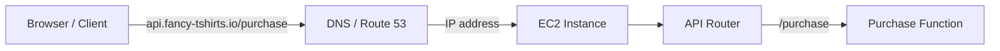
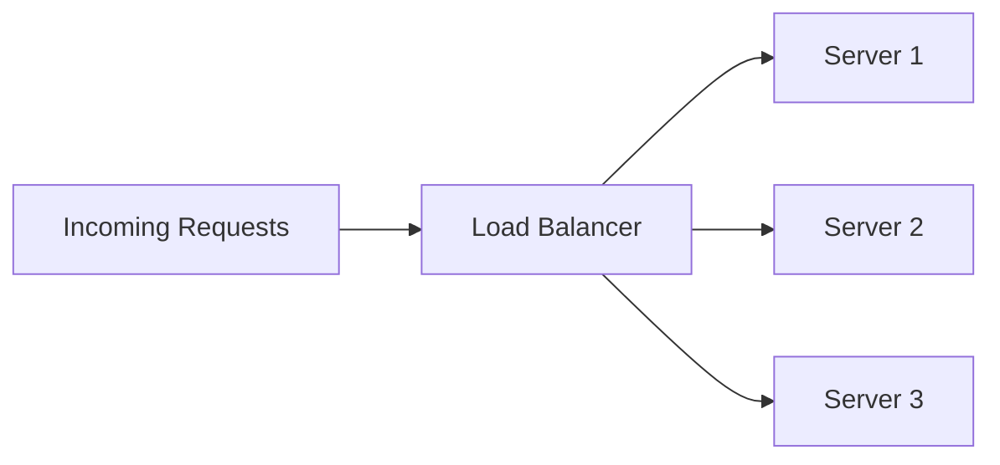
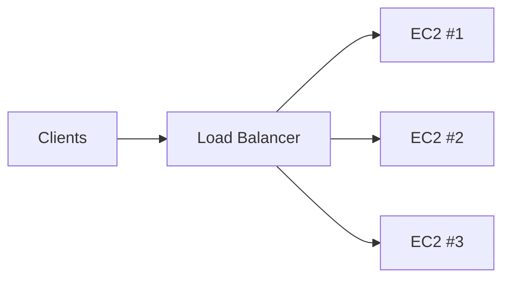
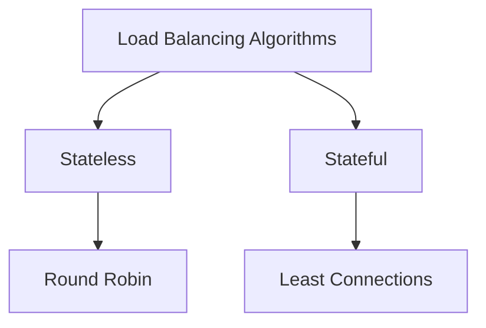
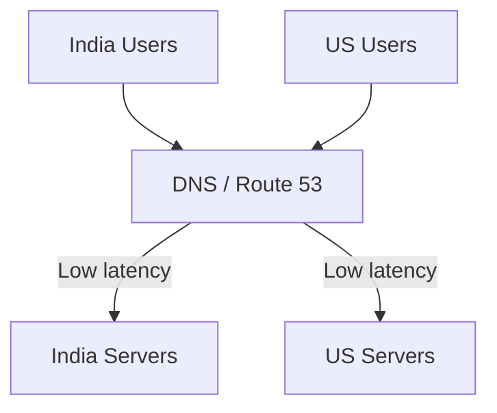
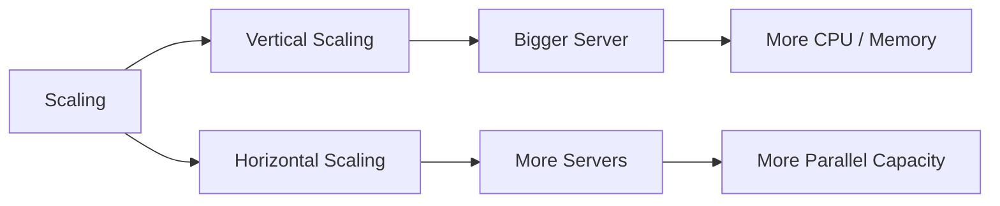
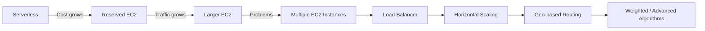

# Serverless or Server-More?

## 1. The Problem: Serverless Becomes Expensive

As the application grows, request volume increases and the AWS bill becomes expensive.

**First optimization steps:**

| Approach              | Idea                                                               |
| --------------------- | ------------------------------------------------------------------ |
| AWS Credits           | Try to reduce cost using available credits                         |
| Code Optimization     | Reduce CPU, memory, I/O usage                                      |
| Caching               | Avoid repeated computation/data access                             |
| Infrastructure Change | Move away from expensive serverless when optimization is exhausted |

> Serverless provides operational simplicity, but you pay a premium because the cloud provider manages the infrastructure for you. 

---

# 2. Moving from Serverless → Reserved EC2

Instead of serverless, reserve compute capacity on AWS for a longer period.

### Why?

Reserved capacity can be significantly cheaper when the workload is predictable.

### Trade-off

| Serverless                      | Reserved/Managed Servers          |
| ------------------------------- | --------------------------------- |
| AWS manages servers             | You manage servers                |
| Automatic scaling               | You manage capacity               |
| Automatic deployment/management | Deployment is your responsibility |
| Higher cost                     | Lower cost                        |
| Less operational effort         | More operational effort           |

You now need to handle:

* Starting/stopping servers
* Deployments
* Upgrades
* Server management


---

# 3. Basic Request Flow

Once a server is reserved, the domain points to that server's IP through DNS.



### Request

```text
GET /purchase?id=123&user_id=456
```

* `/purchase` → identifies the function/API
* Query parameters → provide inputs
* Authentication information → verifies the user


---

# 4. Problem with a Single Large Server

Initially, using one server is simple and cheap.

But as traffic grows, you repeatedly upgrade:

```text
Large → X-Large → XX-Large → XXX-Large → ...
```

This approach eventually breaks down.

### Problems

| Problem                   | Explanation                                                  |
| ------------------------- | ------------------------------------------------------------ |
| Poor utilization          | Server may be heavily underutilized during low traffic       |
| Insufficient during peaks | Same server may not handle traffic spikes                    |
| No redundancy             | Server failure takes down the application                    |
| Expensive scaling         | Continuously buying larger instances                         |
| Less efficient compute    | Multiple smaller machines can provide more parallel capacity |


---

# 5. Why Multiple Smaller Servers?

Instead of:

```text
              ┌──────────────┐
Requests ────►│ Large Server │
              └──────────────┘
```

Use:



### Advantages

* Better parallelism
* Better resource utilization
* Failure of one server does not necessarily bring down the system
* Easier horizontal scaling

The transcript's example illustrates that a fleet of smaller machines can provide more parallel processing capacity for similar cost than one very large machine. 

---

# 6. New Problem → Load Balancing

With multiple servers, requests must be distributed intelligently.

Suppose:

```text
3000 requests
3 servers
```

Ideally:

```text
Server 1 → 1000
Server 2 → 1000
Server 3 → 1000
```

This prevents one server from becoming overloaded and helps maintain lower latency.


---

# 7. Load Balancer

A **load balancer** receives requests and decides which server should handle each request.



AWS provides **Elastic Load Balancer (ELB)** for this purpose.


---

# 8. Common Load-Balancing Algorithms

## Round Robin

Requests are distributed sequentially:

```text
1 → 2 → 3 → 4 → 1 → 2 → 3 → 4 ...
```

### Pros

* Simple
* No complex state required

### Category

**Stateless**


---

## Least Connections

Send the request to the server currently handling the fewest connections.

Example:

```text
Server 1 → 20 connections
Server 2 → 30 connections
Server 3 → 40 connections

New request → Server 1
```

After assigning:

```text
Server 1 → 21
```

### Category

**Stateful**, because the load balancer needs information about current connections.


---

# 9. Stateless vs Stateful Load Balancing

| Stateless                                     | Stateful                   |
| --------------------------------------------- | -------------------------- |
| Doesn't maintain request/server mapping state | Maintains state            |
| Uses a function/rule                          | Uses stored information    |
| Example: Round Robin                          | Example: Least Connections |
| Simpler                                       | More complex               |




---

# 10. Geographic Load Balancing

Servers can also be distributed across regions.

Example:



The idea is to route users to a nearby region for lower latency.

If one region becomes unavailable, traffic can fall back to another region.

This is **geo-based load balancing**.


---

# 11. Horizontal vs Vertical Scaling

| Scaling                | Meaning                          | Example               |
| ---------------------- | -------------------------------- | --------------------- |
| **Vertical Scaling**   | Increase capacity of one machine | Large → X-Large       |
| **Horizontal Scaling** | Add more machines                | 2 servers → 5 servers |




### Practical approach

The transcript recommends a **hybrid approach**:

```text
Reasonably sized instances
        +
Multiple instances
        +
Load Balancing
```

Instead of continuously buying an extremely large machine. 

---

# 12. Weighted Round Robin

When servers have different capacities, equal distribution isn't ideal.

Example:

```text
Server 1 → Large
Server 2 → Small
Server 3 → Small
Server 4 → Small
```

Instead of:

```text
1 → 2 → 3 → 4
```

Use weights:

```text
1 → 1 → 2 → 3 → 4 → 1 → 1 → 2 → 3 → 4
```

The larger server receives more requests.

### Key Idea

**Request distribution should reflect server capacity.**


---

# 13. Overall Evolution



## Key Takeaways

| Concept              | Remember                                    |
| -------------------- | ------------------------------------------- |
| Serverless           | Simple but can become expensive at scale    |
| Reserved instances   | Lower cost, more operational responsibility |
| Single large server  | Simple but poor resilience/utilization      |
| Multiple servers     | Better parallelism and fault tolerance      |
| Load balancer        | Distributes traffic across servers          |
| Round Robin          | Simple, stateless distribution              |
| Least Connections    | Uses current connection state               |
| Geo Load Balancing   | Routes users toward nearby regions          |
| Vertical Scaling     | Bigger machines                             |
| Horizontal Scaling   | More machines                               |
| Weighted Round Robin | Distribution based on server capacity       |

**Core progression:**
**Optimize code → reduce infrastructure cost → move to managed servers → horizontally scale → add load balancing → optimize routing.**

[Prev](05.HardQuestionHardAnswers.md) | [Index](../INDEX.md) | [Next](07.DbLikeMemoryCacheLikeRecall.md)
