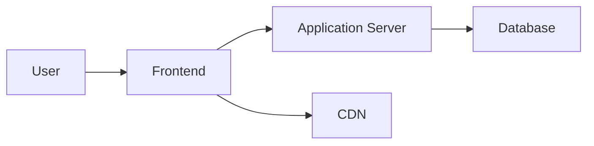
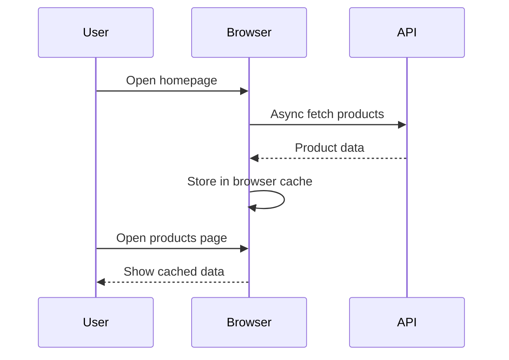
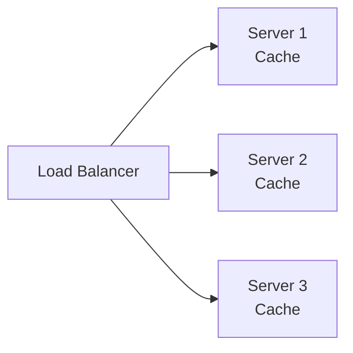
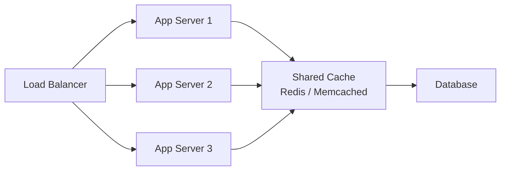
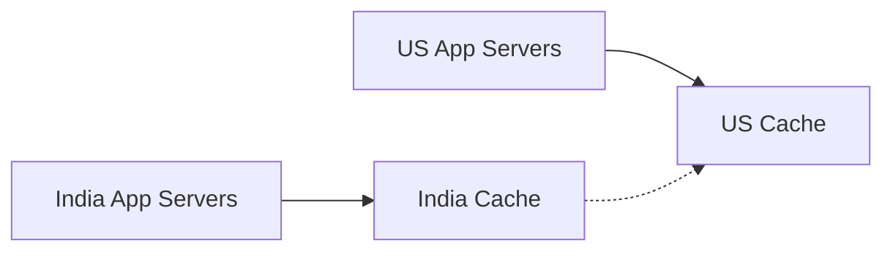
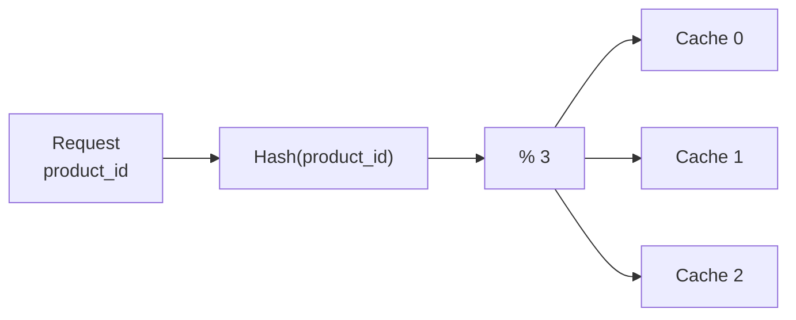
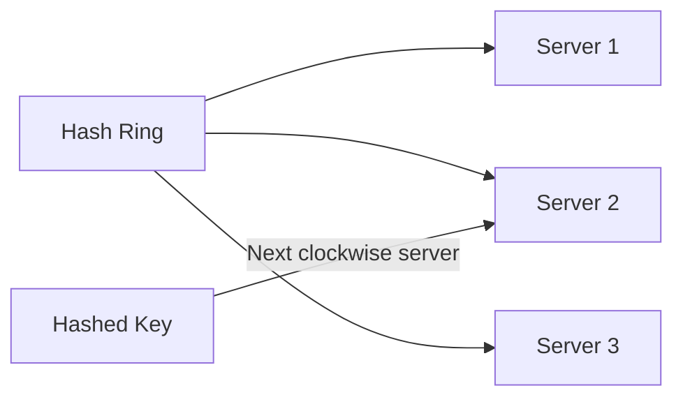
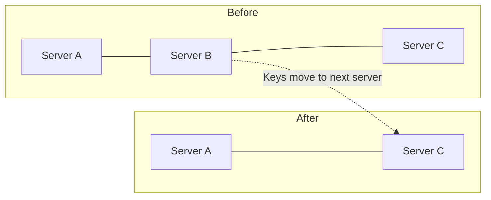
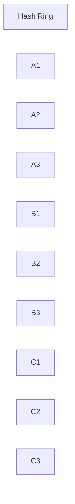
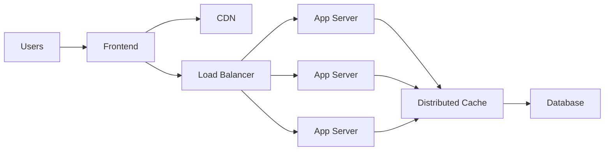

# Caching — System Design Notes

## 1. Problem: API Is Slow

The CDN is fast, but the **API that returns the product list is slow**.



The images load quickly from the CDN; fetching the **product metadata / URLs** from the server is the bottleneck.

### Fundamental principle

> **Reduce latency by bringing data closer to where it is needed.**

---

# 2. Caching

**Caching = storing a temporary copy of data closer to the consumer for faster access.**

Example: Fetch product data when the homepage loads and keep it in the browser.



### Why it works

Instead of:

```text
Products Page → API → Database → Response
```

you get:

```text
Products Page → Local Cache → Response
```

The cache may contain slightly stale data, so it is essentially a **temporary calculated copy**, not the source of truth. 

---

# 3. Where Can We Cache?

Caching can be introduced at different points in the request path.


Possible locations:

| Cache location         | Main benefit                            |
| ---------------------- | --------------------------------------- |
| Browser                | Closest to user                         |
| CDN                    | Close to users geographically           |
| Application server     | Very fast local access                  |
| Dedicated cache server | Shared cache across application servers |

---

# 4. In-Memory Cache

Store cached data directly inside each application server's memory.

Example:

```text
Key:   product_id
Value: product information
```

Implementation can be a simple map or a caching library.

### Advantages

* Extremely fast
* Simple to implement
* Access can be on the order of microseconds

### Disadvantages

* Cache is lost when the server restarts
* Cache must be repopulated from the database
* Multiple application servers have **separate copies**
* Keeping those copies consistent is difficult


---

# 5. Distributed Application Servers + Local Caches

Suppose we have three servers:



Initially each server may contain:

```text
Product 1 → quantity = 5
```

A purchase handled by **Server 1** changes it to `4`.

But:

```text
Server 1 → 4
Server 2 → 5
Server 3 → 5
```

Now the caches are inconsistent.

### Core problem

**Cache coordination / invalidation becomes difficult.**


---

# 6. Dedicated Cache Server

Instead of each application server having its own cache, create a shared cache.



### Advantages

| Dedicated cache                                       | In-memory cache              |
| ----------------------------------------------------- | ---------------------------- |
| Shared by all app servers                             | Each server has its own copy |
| Less data duplication                                 | More duplication             |
| Easier consistency                                    | Harder consistency           |
| Can scale cache independently                         | Cache tied to app server     |
| Can be managed as a separate infrastructure component | Simpler initially            |

The transcript chooses a **global cache**, with Redis or Memcached as examples. 

### Trade-off

Application servers now make a **network call to the cache**, adding architectural complexity and another potential failure point.

---

# 7. Scaling the Cache

A single cache server eventually may not handle all requests.

So we can have:

```text
1 cache
   ↓
3 caches
   ↓
9 caches
   ↓
20 caches
```

Example geographic distribution:



Now we need to answer:

> **Which data should each cache store?**

---

# 8. Sharding

**Sharding = splitting a dataset based on some property and assigning different portions to different servers.**

Possible shard keys:

* Country
* User ID range
* Product ID
* Hash of an ID

Example:

```text
India Cache → Indian products
US Cache    → US products
```

Or:

```text
Cache 1 → User IDs 1–100
Cache 2 → User IDs 101–200
Cache 3 → User IDs 201–300
```


---

# 9. Hash-Based Sharding

A common approach is:

```text
server_id = hash(key) % number_of_servers
```

Example with 3 cache servers:

```text
hash(product_id) % 3
```

Possible results:

```text
0 → Cache 0
1 → Cache 1
2 → Cache 2
```

### Benefits

* Distributes requests across caches
* Same key consistently maps to the same cache
* Reduces duplication




---

# 10. Problem with Simple Hashing

Suppose we have:

```text
3 servers
hash(key) % 3
```

Then we add a 4th:

```text
hash(key) % 4
```

Almost every key may map to a **different server**.

### Result

大量 cache entries need to be moved/reloaded.

```text
Before: hash(key) % 3
After:  hash(key) % 4

        ↓

Large cache migration
        ↓

Database reads
        ↓

Cache warmup
```

Cache warmup can take significant time, especially at scale. 

---

# 11. Consistent Hashing

### Goal

> **Add/remove cache servers while minimizing data movement.**

Instead of mapping keys directly using `% N`, place both:

* Cache servers
* Request keys

on a **hash ring**.



### Basic process

1. Hash the key.
2. Place the key on the ring.
3. Move clockwise.
4. Select the first server encountered.


---

# 12. Why Consistent Hashing Helps

### Adding a server

Only a portion of keys need to move.

### Removing a server

Its keys move to the next server on the ring.



The rest of the system does not need to remap all keys.

### Key advantage

**Much less cache migration during scaling.** 

---

# 13. Virtual Nodes / Virtual Points

A basic consistent-hashing ring can still suffer from **uneven distribution** when there are only a few servers.

Example:

```text
Server A ───── Server A ── Server B ───── Server C
```

Server A could receive too much traffic.

### Solution: Virtual Nodes

Represent each physical server using multiple points on the ring.



For example:

```text
Physical Server A
   ├── Virtual A1
   ├── Virtual A2
   └── Virtual A3
```

### Benefits

* Better load distribution
* Lower chance of hotspots
* Adding/removing a server spreads impact across multiple servers
* Less cache warmup impact


---

# 14. Key Concepts to Remember

| Concept                             | Core idea                                        |
| ----------------------------------- | ------------------------------------------------ |
| **Caching**                         | Store temporary data closer to consumers         |
| **In-memory cache**                 | Cache inside application server memory           |
| **Dedicated cache**                 | Shared cache used by many application servers    |
| **Redis / Memcached**               | Examples of dedicated in-memory caches           |
| **Sharding**                        | Split data across servers                        |
| **Hash-based sharding**             | `hash(key) % N`                                  |
| **Problem with `% N`**              | Adding/removing servers causes massive remapping |
| **Consistent hashing**              | Minimize key movement during scaling             |
| **Virtual nodes**                   | Improve distribution on a consistent-hash ring   |
| **Cache warmup**                    | Loading required data back into cache            |
| **Cache invalidation/coordination** | Keeping cached data consistent                   |

## Overall Architecture



### Evolution

```text
Slow API
   ↓
Browser caching
   ↓
Application-server cache
   ↓
Shared cache
   ↓
Multiple cache servers
   ↓
Sharding
   ↓
Hash-based routing
   ↓
Consistent hashing
   ↓
Virtual nodes
```

[Prev](06.ServerlessOrServerMore.md) | [Index](../INDEX.md) | [Next](08.CaseOfExpensiveCache.md)

