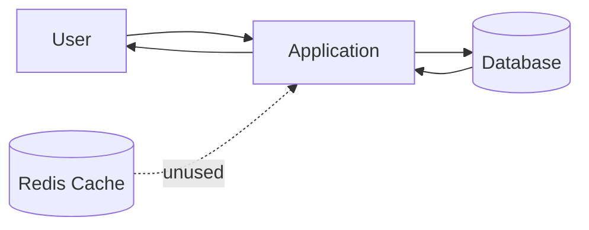
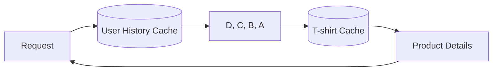
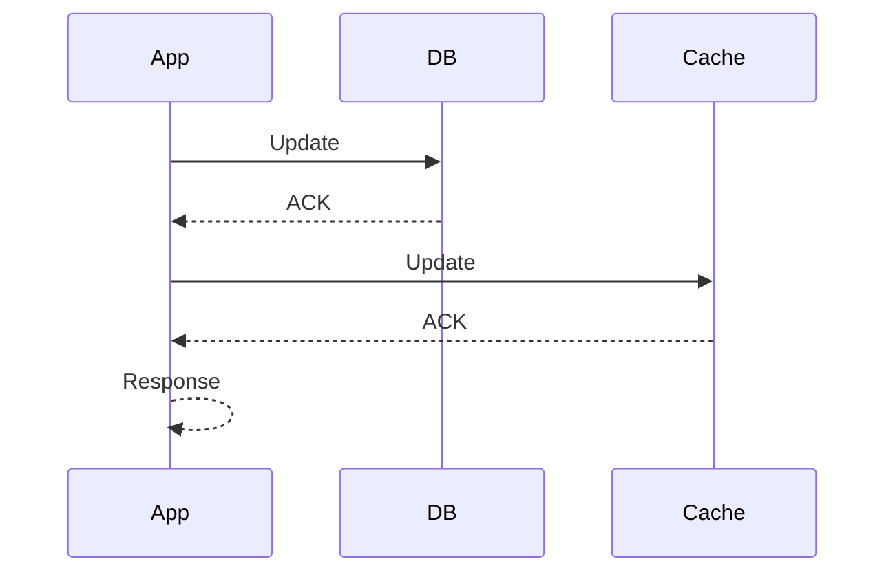
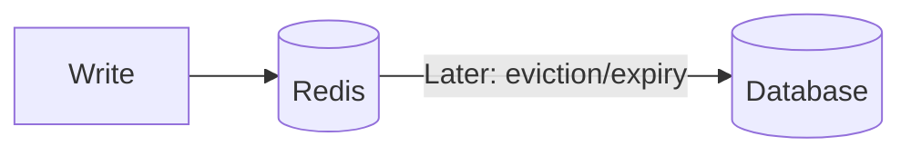
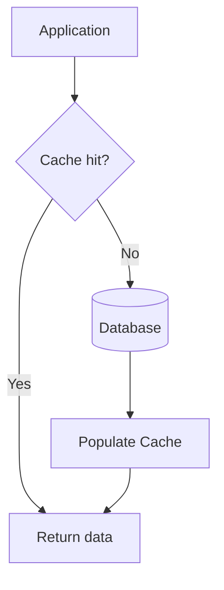
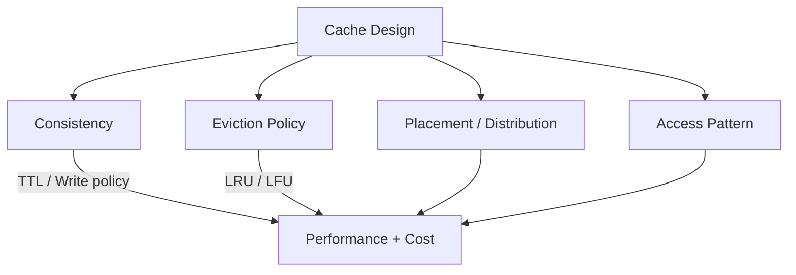

# The Case of expensive Cache

## 1. Problem: Cache is too expensive

The system was using **3 large Redis instances (~$2,000)** for a relatively small application. The first signal is that the cache is probably being used inefficiently rather than genuinely requiring that much capacity. 

### What was stored?

| Data                     | Scope    | Example                      |
| ------------------------ | -------- | ---------------------------- |
| Popular T-shirts         | Global   | Most popular ever            |
| Recently added T-shirts  | Global   | Newly added products         |
| Recently viewed T-shirts | Per-user | User's A → B → C → D history |


---

## 2. First major mistake: Cache isn't actually being used

For "most popular T-shirts", the application executes an SQL `COUNT + GROUP BY` query on the database **every time**, instead of reading the cached result. 



### Core rule

> If every cache read still requires a database query, the cache defeats its own purpose.

The goal is to reduce database work, not simply store a duplicate copy of the data. 

---

# 3. Don't store heavy objects in cache

For per-user recently viewed products, the cache stores:

```text
userID → [full T-shirt object A, B, C, D]
```

This duplicates large metadata for every user. 

### Better design

Store only IDs:

```text
userID → [D, C, B, A]
```

Then fetch product details separately.



This avoids duplicating product metadata across users, allowing **more information with less memory → fewer/smaller Redis nodes → lower cost**. 

---

# 4. Cache consistency ≠ always latest data

The engineers avoided cache because they were worried that:

```text
Database = latest
Cache = slightly old
```

For **popular T-shirts**, exact real-time ordering may not matter.

Example:

* Rank #10 and #11 may swap.
* Showing the old ordering for 1–6 hours may still be acceptable.
* The required freshness should be a **product/business decision**, not automatically assumed to be real-time. 

### Cache expiry

Set a TTL based on business requirements:

| Requirement         | Example TTL |
| ------------------- | ----------: |
| Near real-time      |   Short TTL |
| Popular products    |      1 hour |
| Less sensitive data |     6 hours |

Entries can be expired individually or the entire cache can be expired. 

---

# 5. Consistent Cache

A **consistent cache** maintains data equivalent to the database while providing faster reads. 

The mechanism used to keep cache and DB synchronized is called a **write/update policy**.

---

## 6. Write-through vs Write-back

### Write-through

Update DB first → update cache → respond.



**Benefit:** Stronger consistency; less risk of losing updates.
Useful when data cannot be lost, e.g. payment-related information. 

---

### Write-back

Update cache first → continue serving from cache → write to DB later, typically on eviction/expiry. 



Example:

```text
Cache updates: 15 → 20 → 30
DB update later: +65
```

### Advantages

| Write-through          | Write-back                    |
| ---------------------- | ----------------------------- |
| DB updated immediately | DB updated later              |
| Better durability      | Lower DB I/O                  |
| More DB load           | Less DB load                  |
| Safer                  | Risk of losing cached updates |

Write-back is acceptable when losing some recent data is tolerable. 

> **Key trade-off:** consistency/durability vs performance/cost.

---

# 7. Other cache write policies

The transcript also mentions:

* **Write-aside**
* **Write-around**
* **Look-aside cache**

These are alternatives, but the lecture focuses mainly on write-through and write-back. 

---

# 8. Look-aside Cache

Here, the **application** manages both DB and cache independently.

### Read path



Typical flow:

1. Check cache.
2. Cache miss → query DB.
3. Put result into cache.
4. Return result.

This is commonly described as a **look-aside cache**. 

---

# 9. Cache Access Patterns Matter

The system has three cache categories:

| Entry                    | Problem                              |
| ------------------------ | ------------------------------------ |
| Popular T-shirts         | Shared across users → manageable     |
| Recently added T-shirts  | Shared across users → manageable     |
| Recently viewed T-shirts | **Per-user → grows with user count** |

With 1M users, recently viewed data could mean ~1M cache entries. 

### Solution: Cache only active users

"Active" can mean:

* **Frequently active** → users with many logins
* **Recently active** → users who logged in recently

Then retain only a subset, e.g. **top 10% or top 1,000 users**. 

---

# 10. Eviction Policies

When cache capacity is full, some entry must be removed. This is **eviction**.

### LRU — Least Recently Used

Remove the user who has not been used recently.

```text
Cache full
   ↓
Find least recently used
   ↓
Evict
   ↓
Insert new entry
```


### LFU — Least Frequently Used

Remove the entry with the lowest usage count.

**Problem:** old usage can dominate.

A user who was extremely active months ago may remain in the cache while a newly active user is excluded. 

### LRU vs LFU

| Policy  | Based on        | Best for               |
| ------- | --------------- | ---------------------- |
| **LRU** | Recent usage    | Fresh/current activity |
| **LFU** | Total frequency | Long-term popularity   |

---

# 11. Four Important Cache Design Factors

A good cache design depends mainly on:

| Factor                       | Question                                   |
| ---------------------------- | ------------------------------------------ |
| **Consistency**              | How fresh must cached data be?             |
| **Eviction policy**          | What should be removed when full?          |
| **Placement / Distribution** | Where should data live?                    |
| **Access pattern**           | What data is frequently/recently accessed? |

The transcript emphasizes that these factors largely determine cache performance. 

---

## Final Mental Model



### Key Takeaways

> **Cache only what needs to be fast.**
> **Store lightweight data where possible.**
> **Don't demand real-time consistency unless the business requires it.**
> **Choose write policy based on data-loss tolerance.**
> **Eviction policy should match the access pattern.**
> **Cache design is ultimately a trade-off between performance, consistency, memory, and cost.**


[Prev](07.DbLikeMemoryCacheLikeRecall.md) | [Index](../INDEX.md) | [Next](09.SaleDayJitters.md)
