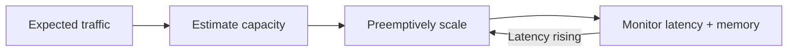
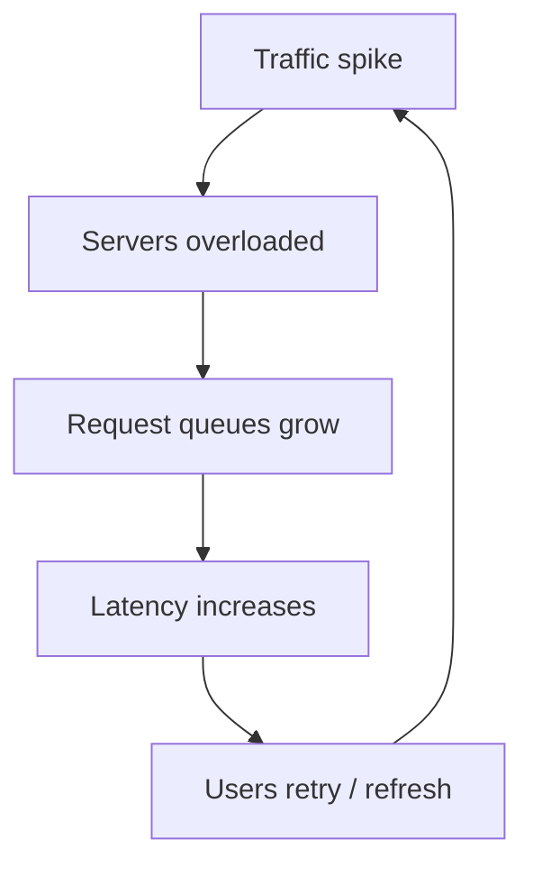
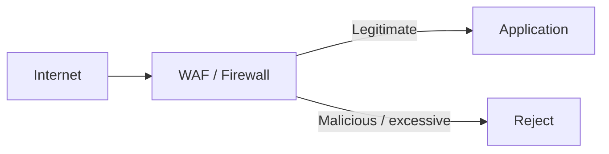
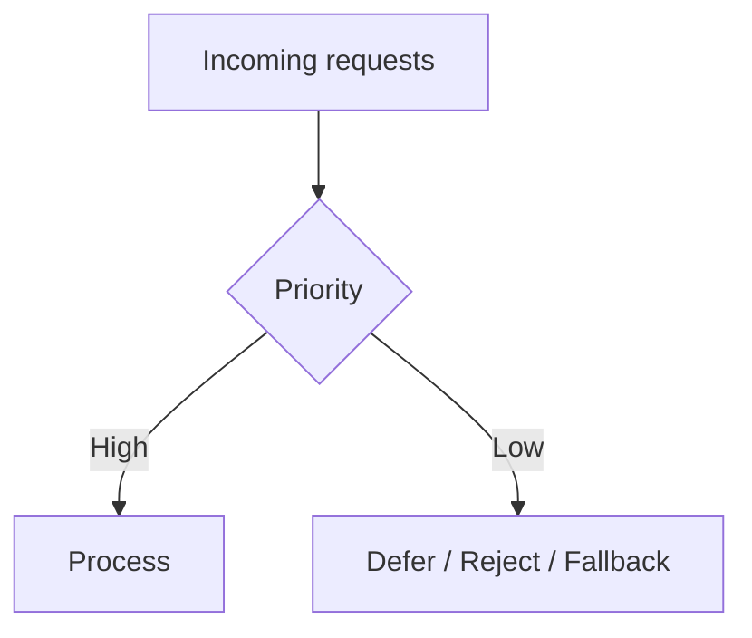
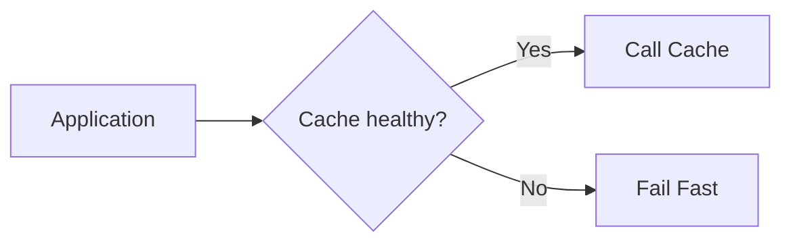
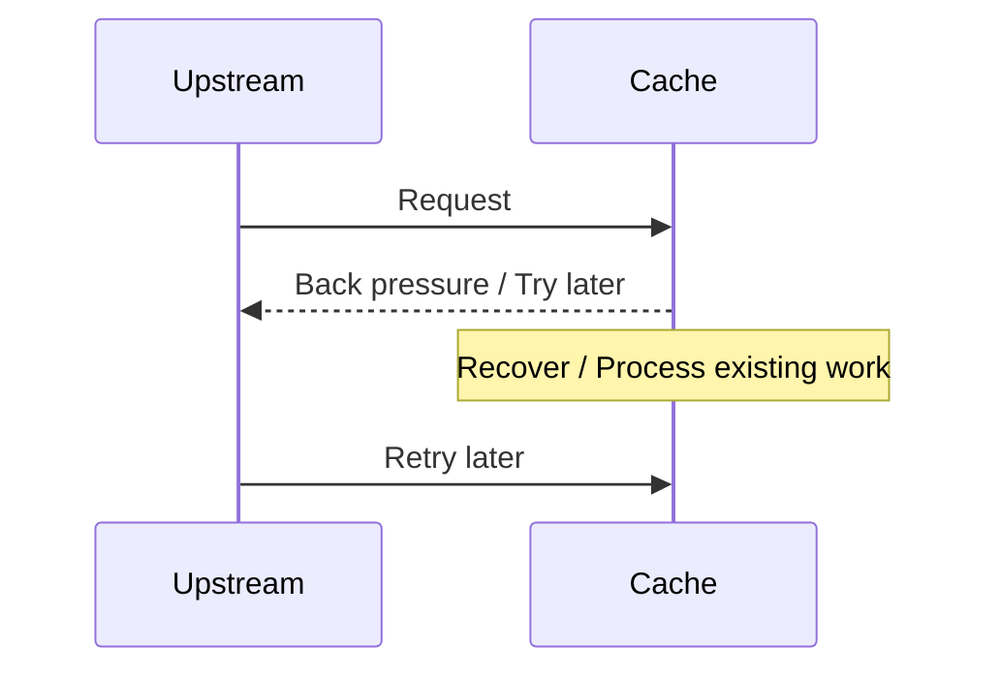
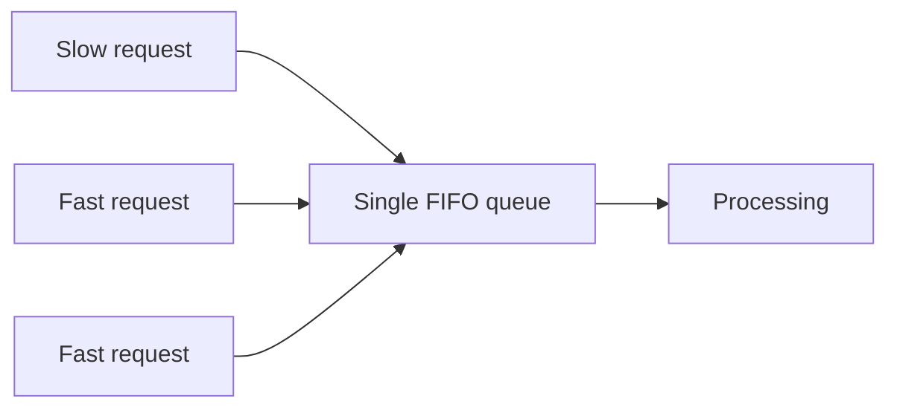
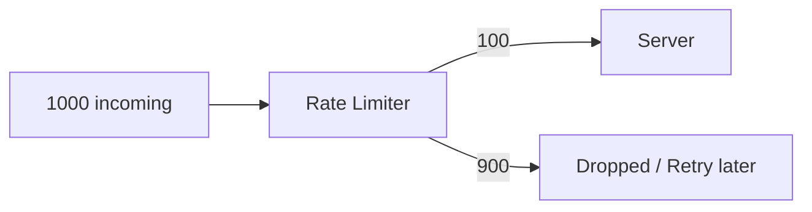
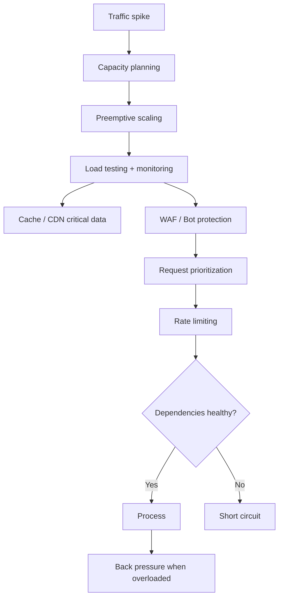

# Flash Sale Day Jitters

## 1. Flash Sale = Sudden Traffic Spike

A flash sale creates a short period of extremely high traffic: browsing, registrations, orders, payments, and status checks can all spike simultaneously. The first step is to **quantify the expected load**, rather than simply saying "a lot of users." 

### Capacity planning

| Question                    | Example                                  |
| --------------------------- | ---------------------------------------- |
| Existing traffic            | 2,000 sales/day                          |
| Expected flash-sale traffic | ~10×                                     |
| Existing capacity           | 10 servers                               |
| Possible temporary capacity | 3×–10×                                   |
| Decision                    | Depends on cost, margins & acceptable UX |

Preemptively scaling before the event is preferable to discovering the capacity limit during the sale. 



---

# 2. Load Testing

Don't guess how much traffic one server can handle. **Progressively increase the load** and find the point where latency exceeds the acceptable limit. 

Example:

|          Load | Avg latency | Result     |
| ------------: | ----------: | ---------- |
|  10K requests |        1 ms | ✅          |
|  20K requests |      100 ms | ✅ Capacity |
| 100K requests |       1 sec | ❌ Too high |

Therefore, if one server handles ~20K requests within the latency requirement, ~40K requests require roughly 2 servers.

**Key idea:** load testing establishes the relationship between **traffic → latency → required capacity**.

---

# 3. Optimize the Request Path

Analyze the **access pattern and request path** for every important operation. 

For flash sales:

* Cache commonly shared T-shirt information.
* CDN can serve frequently requested information close to users.
* Keep critical-path operations as lightweight as possible.
* Optimize code that executes on every request.

CDNs aren't limited to images/videos; the transcript notes they can also serve application information that changes infrequently. 

---

# 4. The First Failure: Unexpected Traffic

The first flash sale gets an unexpectedly massive spike—around **1M concurrent users/requests**—far beyond the expected 10× load. The servers become overloaded, queues grow, latency increases, and users start retrying/refreshing, making the situation worse. 



This creates a **positive feedback loop**.

---

# 5. DDoS / Bot Protection

Logs reveal that some users are generating thousands of requests within seconds. Such traffic may indicate bots or a **DDoS attack**, especially when requests come from many users/IPs. 

### Protection

Use a gatekeeper before requests reach the application:



A **Web Application Firewall (WAF)** can inspect requests and block suspicious traffic before it consumes application/server resources. 

---

# 6. Graceful Degradation

When the system cannot serve everything, **don't treat every request equally**.

Example:

| Request                  | Priority |
| ------------------------ | -------- |
| Payment                  | 🔴 High  |
| Order status             | 🔴 High  |
| Customer support         | 🔴 High  |
| Recently viewed T-shirts | 🟢 Low   |
| Non-critical UI data     | 🟢 Low   |

Serve critical requests and reject/degrade lower-priority requests. This is **request priority + graceful degradation**. 



### Principle

> Better to serve some users successfully than make everyone wait and eventually fail. 

---

# 7. Short Circuit

When a downstream dependency is already overloaded, don't keep sending requests to it.

Example:



If the cache/database is taking several seconds and requests will likely timeout anyway, **fail immediately instead of adding more load**. This is called **short circuiting**. 

Benefits:

* Stops cascading overload.
* Removes pressure from unhealthy services.
* Gives the downstream service time to recover.

---

# 8. Back Pressure

**Back pressure** is the downstream service signaling upstream that it cannot accept more work.

Example:



If the cache normally responds in 100 ms but is taking ~2 seconds, it can start rejecting new requests immediately rather than continuing to process an unsustainable load. 

**Short circuit:** upstream decides not to call downstream.
**Back pressure:** downstream tells upstream to slow/stop.

---

# 9. Head-of-Line (HOL) Blocking

Suppose requests are processed strictly FIFO:

```text
R1 (slow DB query)
R2
R3
R4
```

If `R1` takes a long time, **R2–R4 wait even if they could complete quickly**. This increases average latency and is called **Head-of-Line Blocking**. 



### Solutions

**Parallelism**

* Multiple queues / machines / cores process requests simultaneously.

**Concurrency**

* A slow request can temporarily yield while other requests are processed.

The transcript also mentions protocols such as **gRPC** supporting multiple request queues to avoid HOL blocking through out-of-order processing. 

---

# 10. Rate Limiting

At extreme load, scaling cannot happen instantly.

If:

```text
Capacity = 100 requests
Incoming = 1000 requests
```

Then **900 requests must be rejected/dropped** rather than allowing the queue to grow indefinitely. 



### Rate Limiting

Keeps the number of requests processed by a server at its maximum sustainable level even when incoming traffic exceeds capacity. 

The transcript introduces **Token Bucket** as one common algorithm. 

---

# 11. Overall Strategy



### Final Checklist

| Problem                             | Technique                     |
| ----------------------------------- | ----------------------------- |
| Predictable traffic spike           | **Preemptive scaling**        |
| Unknown capacity                    | **Load testing**              |
| Repeated/shared data                | **Cache / CDN**               |
| Malicious traffic                   | **WAF / Firewall**            |
| Too many requests                   | **Rate limiting**             |
| Critical vs non-critical traffic    | **Request priority**          |
| System under pressure               | **Graceful degradation**      |
| Slow dependency                     | **Short circuit**             |
| Downstream overloaded               | **Back pressure**             |
| FIFO queue bottleneck               | **Concurrency / Parallelism** |
| Slow request blocking fast requests | **Avoid HOL blocking**        |

**Core principle:** at extreme scale, the goal is not to process every request. The system should **protect itself, prioritize important work, shed excess load, and recover gracefully**. 

[Prev](08.CaseOfExpensiveCache.md) | [Index](../INDEX.md) | [Next](10.ACTOisBorn.md)
