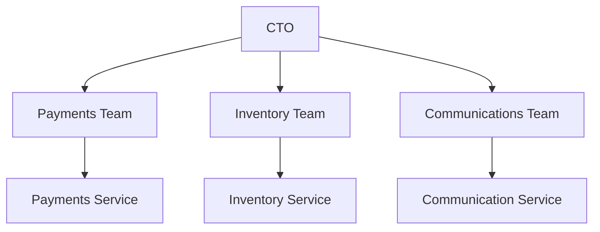
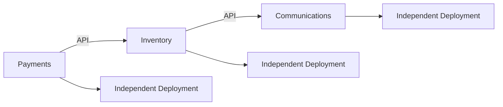
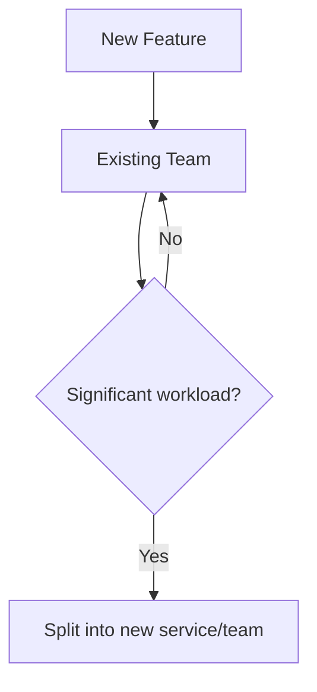
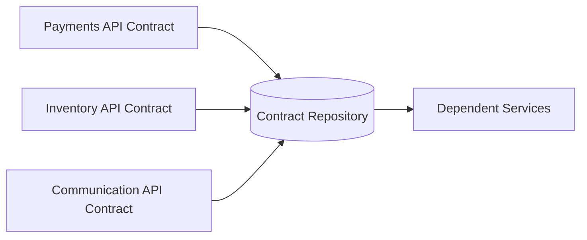
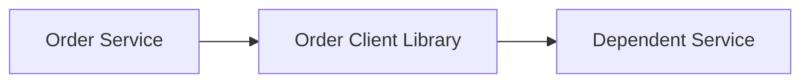
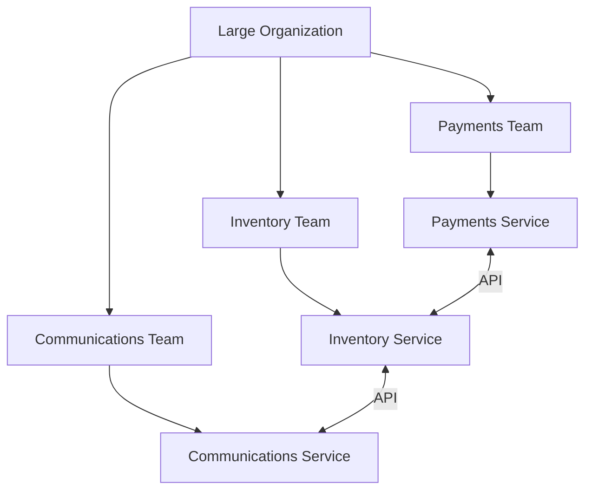

# Scaling Engineering Teams & Microservices

## 1. Problem: Team Growth Creates Technical Problems

The engineering team grows from **5 → 15 engineers**, with a longer-term goal of ~100. The organization is also expanding beyond T-shirts into accessories and subscriptions. 

### Symptoms

| Symptom                                | Result                |
| -------------------------------------- | --------------------- |
| Large team needs everyone in standups  | Long meetings         |
| New engineers need lots of handholding | Slow onboarding       |
| Deployments are infrequent             | Slow feature delivery |
| Everyone touches the same areas        | No clear ownership    |
| Nobody is a domain expert              | Difficult debugging   |


The root problem: **one large, complex codebase is being modified by too many people simultaneously.** 

---

# 2. Split Teams by Business Responsibility

Instead of one large team, create smaller teams around **business functions**.

Example:



Example allocation:

| Team           | Responsibility                |
| -------------- | ----------------------------- |
| Payments       | Payments & gateways           |
| Inventory      | Stock management              |
| Communications | Emails, dashboards, analytics |

This provides **isolation of concerns** and lets the CTO work with teams independently instead of coordinating everyone together. 

---

# 3. Benefits of Team + Code Separation

### Independent development

Each team can:

* Own its codebase.
* Have its own deployment cycle.
* Deploy without waiting for other teams.
* Expose APIs to other teams.
* Scale independently.




### Main benefit

> **Organizational boundaries should be reflected in code boundaries.**

This increases organizational/developer efficiency even though network communication may make the code itself slightly less efficient. 

---

# 4. Trade-offs of Splitting Services

Splitting isn't free.

| Benefit                  | Cost                                    |
| ------------------------ | --------------------------------------- |
| Clear ownership          | More communication between teams        |
| Independent deployments  | Network calls instead of function calls |
| Smaller codebases        | Duplicate common functionality          |
| Independent scaling      | More infrastructure/DevOps work         |
| Better team productivity | More documentation required             |

A function call within one process becomes a **network/API call** when services are separated, adding latency and complexity. 

---

# 5. Avoid Technology Sprawl

For a small organization, avoid every team choosing different technologies.

| Bad                 | Better                              |
| ------------------- | ----------------------------------- |
| Team A → PostgreSQL | Standardize on PostgreSQL           |
| Team B → MySQL      |                                     |
| Team A → Go         | Prefer common stack where practical |
| Team B → Python     |                                     |

Different languages/databases make debugging, hiring, movement between teams, and maintenance harder. 

As the organization grows, common functionality such as **logging, caching, and infrastructure** can be handled by a shared DevOps/platform team. 

---

# 6. Don't Create Microservices Too Quickly

A common mistake is:

> "This feature doesn't perfectly fit an existing team → create a new service."

That can lead to **nano-services**: too many tiny services with too few engineers. 

### Better approach



First add a related feature to an existing team. Split it only when the **business workload/responsibility becomes substantial**. 

### Another signal

If a service communicates almost exclusively with one other service, their business boundaries may be wrong and the two responsibilities may belong together. 

---

# 7. Service Boundaries

The objective is to identify **business boundaries**, then map them to teams and services.


Good boundaries allow teams to work in parallel and increase organizational throughput. 

---

# 8. Cross-Team Communication Gets Expensive

As teams become independent, communication happens through:

* People → meetings/docs
* Services → APIs

Therefore, **documentation becomes increasingly important** as the organization grows. Architecture decisions and communication should be documented clearly. 

---

# 9. API Contracts

When services communicate through APIs, the API contract should be explicit.

An API contract defines:

| Contract element  |
| ----------------- |
| Function/endpoint |
| Parameters        |
| Response          |
| Error codes       |

It describes **what** the service accepts/returns, not its internal implementation. 

### Central contract repository



All teams should be able to access the latest contracts. 

---

# 10. Breaking Changes

Suppose an existing API accepts:

```text
getOrderStatus(tshirtID)
```

and changes to:

```text
getOrderStatus(itemID, itemType)
```

Existing consumers may break after deployment. This is a **breaking change**. 

### Prefer backward compatibility

The old request can continue working:

```text
itemID = 123
itemType = null
        ↓
Assume itemType = "tshirt"
        ↓
Process request
```

New clients can use the new API while old clients continue working. 

> **API changes should not unexpectedly break existing clients.**

---

# 11. Client Libraries

Each service can provide a **client library** that other services use to call its APIs. 



When the API contract changes, a new client-library version communicates that change to consumers. Compilation/type errors can expose incompatibilities **before deployment/runtime**. 

---

# 12. Microservices Mental Model



### Final Takeaways

| Principle               | Remember                                                                                  |
| ----------------------- | ----------------------------------------------------------------------------------------- |
| **Team scaling**        | Split large teams by business responsibility                                              |
| **Code organization**   | Code boundaries should reflect team boundaries                                            |
| **Ownership**           | Each team should own a meaningful business capability                                     |
| **Microservices**       | Use for isolation and independent deployment, not because a feature is slightly different |
| **Avoid nano-services** | Split only when the business/workload justifies it                                        |
| **Technology**          | Prefer organizational consistency                                                         |
| **APIs**                | Treat contracts as first-class artifacts                                                  |
| **Breaking changes**    | Maintain backward compatibility                                                           |
| **Client libraries**    | Make API changes visible to dependent services                                            |
| **Scaling principle**   | Optimize the organization even if some network/code overhead increases                    |


[Prev](09.SaleDayJitters.md) | [Index](../INDEX.md) | [Next](11.Concluding.md)
