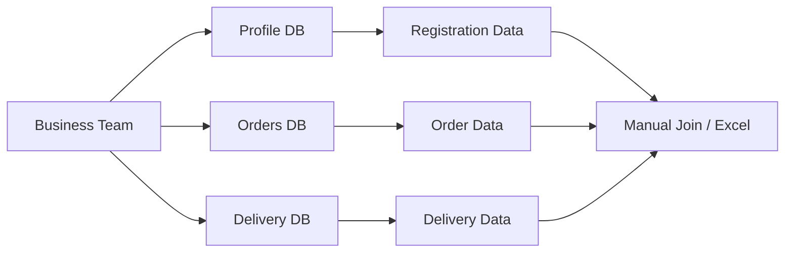
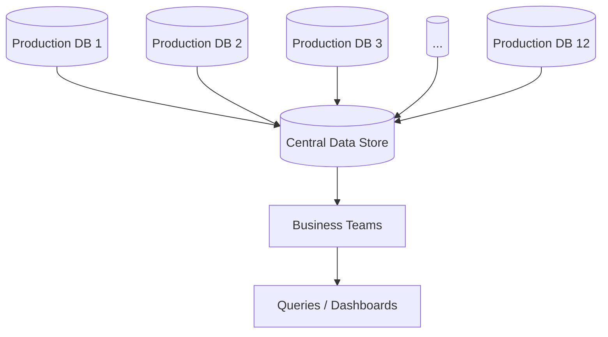
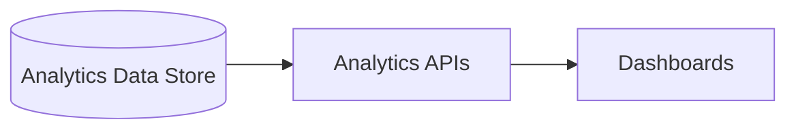
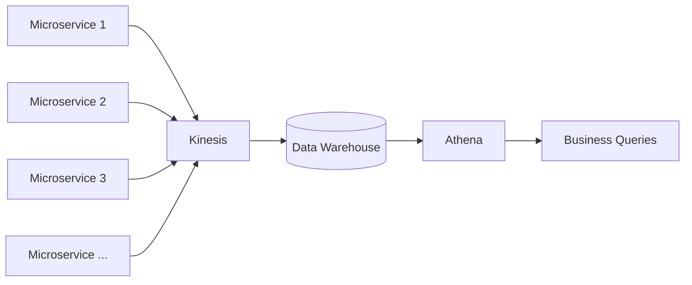
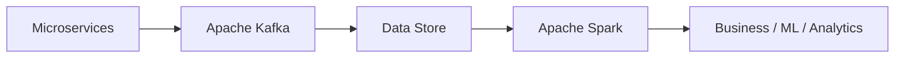
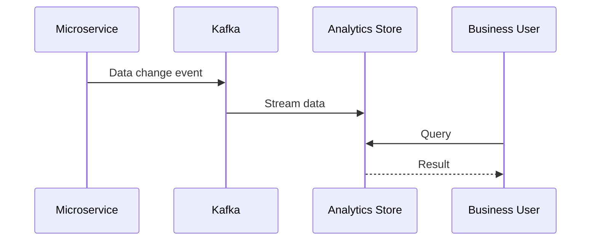
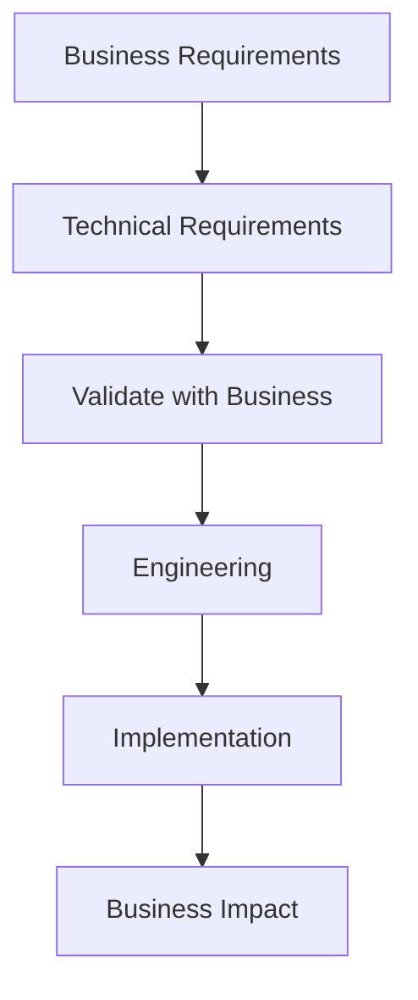
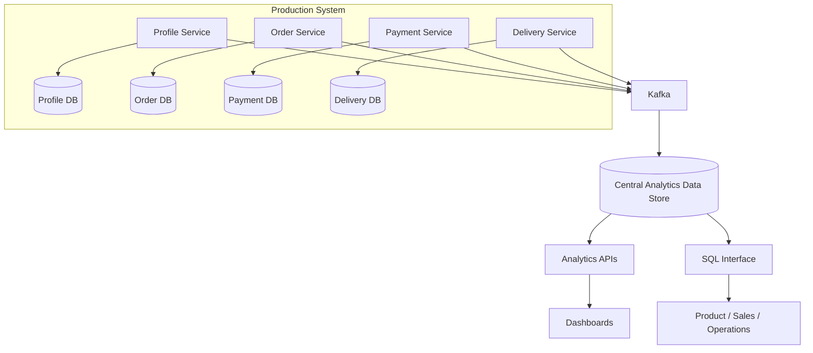
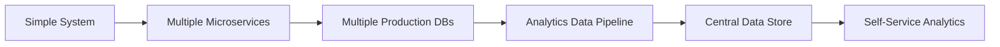

# Data Analytics Architecture — System Design Notes

## 1. Problem: Business Teams Depend Too Much on Engineering

As the organization grows to many teams, business teams need frequent data insights but must depend on engineers to retrieve data.

### Problems

| Problem                                 | Impact                            |
| --------------------------------------- | --------------------------------- |
| Engineers run analytics queries         | Slow insights                     |
| Business queries span multiple services | Difficult coordination            |
| Different teams own different data      | No single place to query          |
| Ad-hoc SQL hits production DBs          | Can affect production performance |
| Product teams need frequent exploration | Too much engineering dependency   |

Example query:

> Find users who purchased a T-shirt **≥3 days after registration**.

This requires registration data + order data + potentially delivery data from different teams.



The root problem is **tight coupling between business teams and technology teams for data insights**.

---

# 2. Separate Production from Analytics

Instead of allowing business teams to query the production databases, create a **central copy of data** from all production systems.



### Two separate worlds

| Production system          | Analytics system            |
| -------------------------- | --------------------------- |
| Serves application traffic | Serves business queries     |
| Latency-sensitive          | Analytics-oriented          |
| Writes + reads             | Mostly reads                |
| Must remain stable         | Can handle heavy queries    |
| Used by engineers/services | Used by business/data teams |

This prevents heavy analytical queries from affecting production databases.

---

# 3. Benefits of a Central Data Copy

Business teams can now:

* Run their own queries.
* Create dashboards.
* Download data.
* Combine information from multiple services.
* Explore data without contacting multiple engineering teams.

### Key benefit

> **Decouple business analytics from production systems.**

A heavy query may take a long time or acquire expensive locks on a production DB; querying the separate copy avoids that risk.

---

# 4. Analytics Layer

The analytics side can expose two kinds of functionality.

### Predefined dashboards

Useful for frequently requested metrics:

| Dashboard    | Example                      |
| ------------ | ---------------------------- |
| Sales        | Daily sales amount/count     |
| Registration | Number of registrations      |
| Delivery     | Pending/completed deliveries |
| Orders       | Order-related metrics        |



### Custom queries

For product managers / analysts who want to explore data:

```text
Business User
    ↓
SQL Interface
    ↓
Central Data Store
    ↓
Custom Analysis
```

The transcript suggests that users may write SQL themselves, use a data analyst, or even use ChatGPT to generate queries—as long as the underlying capability is available.

---

# 5. Data Engineering Requirement

The key remaining problem:

> **How do we continuously populate the central data store?**

Requirements:

1. Keep it simple.
2. Meet business requirements.
3. Keep it cost-effective.

---

# 6. Initial Solution: Kinesis + Athena

The transcript proposes AWS services:



### Responsibilities

| Component          | Role                             |
| ------------------ | -------------------------------- |
| **Kinesis**        | Stream data/events from services |
| **Data Warehouse** | Centralized analytical copy      |
| **Athena**         | Query the analytical data        |

Existing microservices mainly need to **publish data-change events** rather than directly participate in analytics.

---

# 7. Open-Source Alternative

The product team raises a technology/hiring concern: avoid excessive AWS-specific dependencies.

Possible alternative:

| AWS-oriented               | Open-source-oriented          |
| -------------------------- | ----------------------------- |
| Kinesis                    | **Apache Kafka**              |
| Athena / AWS data services | **Hadoop / S3-based storage** |
| AWS query ecosystem        | **Apache Spark**              |



### Why choose the open-source stack?

* Easier hiring for existing technologies.
* Engineers already understand Kafka/Spark.
* Less vendor-specific.
* Potentially easier migration across cloud providers.

The trade-off is **more operational complexity**, but that complexity can be owned by the relevant data/operations team.

---

# 8. Microservices → Analytics Data Flow

The important design change for existing services is small:



Production services continue doing their normal work while analytics data is populated asynchronously.

---

# 9. CTO's Role: Enable, Don't Become the Bottleneck

The important organizational lesson is that the CTO should not solve every individual request.

### Bad approach

```text
Sales → Engineer → SQL
Product → Engineer → SQL
Operations → Engineer → SQL
```

### Better approach

```text
                 ┌─ Sales
                 ├─ Product
Analytics Store ─┼─ Operations
                 └─ Data Analysts
```

Business teams become **self-service consumers of data**.

> The CTO's job is to build capabilities that allow teams to solve their own problems.

---

# 10. Business Requirements → Technical Design

The design process follows:



The important point is **stakeholder validation before implementation**.

Business stakeholders understand the expected outcome, while engineers understand the technical implications.

---

# 11. Final Architecture



---

# 12. Key Takeaways

| Concept                     | Core Idea                                                    |
| --------------------------- | ------------------------------------------------------------ |
| **Production vs Analytics** | Never make production systems the primary analytics workload |
| **Central data store**      | Combine data from multiple services                          |
| **Data streaming**          | Propagate changes asynchronously                             |
| **Self-service analytics**  | Let business teams query data themselves                     |
| **Dashboards**              | Serve frequently requested metrics                           |
| **Custom SQL**              | Support exploratory analysis                                 |
| **Kafka/Kinesis**           | Stream data changes                                          |
| **Spark/Athena**            | Query/process analytical data                                |
| **Decoupling**              | Business teams shouldn't depend on engineers for every query |
| **CTO mindset**             | Build reusable capabilities, not one-off solutions           |

### Overall Evolution



**Big lesson:** As an organization grows, system design is not just about scaling servers. You also need to scale **how teams access data, communicate, and make decisions**.

[Prev](10.ACTOisBorn.md) | [Index](../INDEX.md) | 
